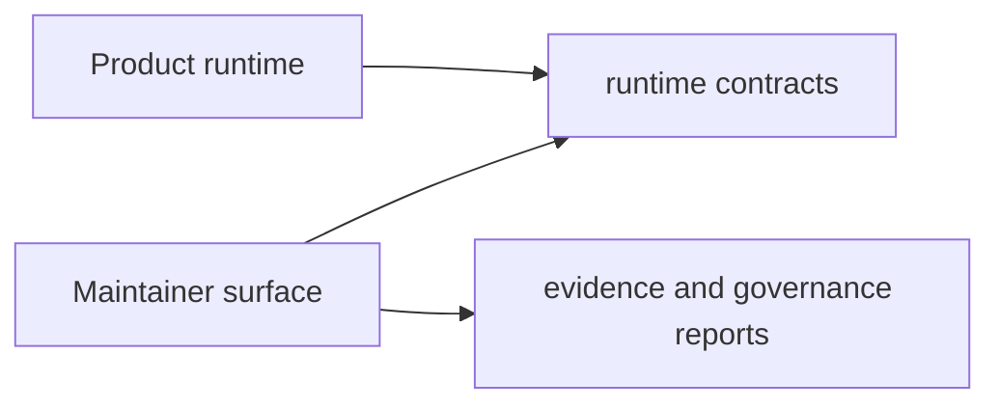

# Maintainer Surface

Maintainer capabilities are isolated from end-user runtime paths so governance
automation does not distort product command behavior.

## Separation Map

## Control-Plane Responsibilities

- repository structure and contract audits
- evidence generation and verification workflows
- release readiness and compatibility checks
- documentation governance and layout validation

## Separation Rules

- product runtime crates do not import maintainer command logic
- maintainer crate may call product contracts as read-only inputs
- operational decisions must be explainable from generated evidence

## Separation Non-Goals

- maintainer commands must not become hidden user-facing runtime entrypoints
- governance reports must not override crate-level ownership boundaries
- release automation must not bypass required program contract checks

## Escalation Path

When a maintainer command needs product behavior changes, escalate in this
order:

1. update owning program handbook (`bijux-cli` or `bijux-dag`)
2. add contract/test evidence in the owning crate
3. update maintainer workflows that consume the new evidence

## Reading Rule

Use this page when the question is about repository governance machinery rather
than user-facing runtime behavior.

## Code Anchors

- `crates/bijux-dev/src/commands/mod.rs`
- `crates/bijux-dev/src/suites/`
- `crates/bijux-dev/src/report/`
- `crates/bijux-dev/src/maintainer/`

## Next Reads

- [Dependency Direction](dependency-direction.md)
- [Repository Gates](../../bijux-dev/operations/repository-gates.md)
- [Quality Policy](../../bijux-dev/governance/quality-policy.md)
