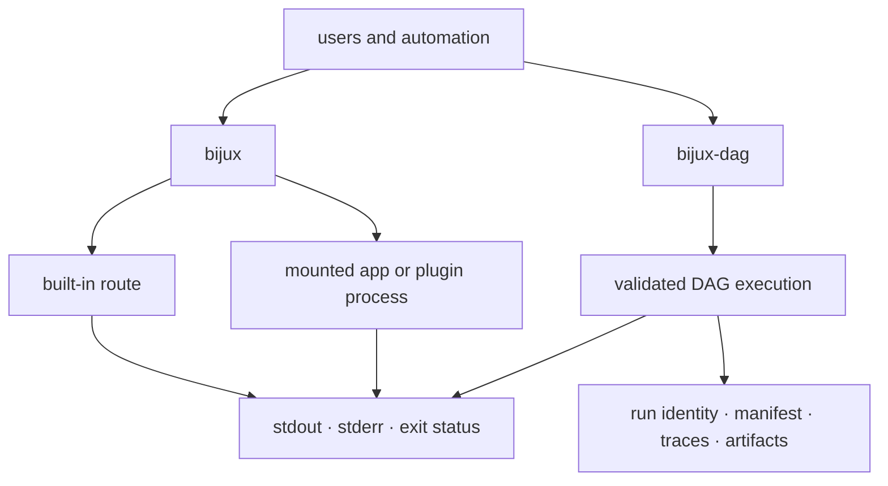

# Runtime Surfaces

`bijux-core` publishes two runtime families that readers and automation can
interact with directly:

- `bijux`, the operator-facing CLI
- `bijux-dag`, the local-first DAG runtime and command surface

They are built from different crates, but they are not unrelated products.
They share repository-level rules around configuration, output honesty,
contract drift, and release proof. This page maps the public runtime surfaces
without collapsing them into one blurred interface.

## Surface Map

## Product Outcomes

| Concern | `bijux` | `bijux-dag` |
| --- | --- | --- |
| primary input | argv, REPL line, layered config, mounted namespace | graph source, execution options, backend selection |
| pre-execution truth | normalized route, lifecycle state, compatibility, configuration provenance | parsed and canonical graph, validation result, deterministic plan |
| effects | built-in state mutation or delegated process execution | node attempts, backend work, artifact and run-directory writes |
| immediate result | stdout, stderr, and exit status | command streams, exit status, and run identity |
| durable result | config, history, memory, and plugin records owned by the command | manifest, node traces, output index, declared artifacts, and replay inputs |
| diagnostic question | which route, layer, plugin, or process produced the outcome? | which graph, plan, node, attempt, backend, or artifact produced the outcome? |
| security limit | plugins are not sandboxed from the current user account | backend selection is not itself an isolation guarantee |

## Shared Runtime Rules

Both products preserve the following invariants even though their state models
are different:

- human, JSON, JSON Lines, or YAML presentation cannot change command meaning;
- a nonzero delegated outcome cannot be wrapped as built-in success;
- aliases resolve to a canonical identity before execution and diagnostics;
- a compatibility or integrity refusal occurs before untrusted state is used;
- reason codes and lifecycle states remain machine-readable;
- internal or gated routes do not become supported merely because they compile.

## Delegation And Authority

`bijux` may invoke a mounted app or plugin. `bijux-dag` may invoke a process,
container engine, scheduler adapter, or Kubernetes API. In both cases the
external actor supplies work, but the owning product still controls acceptance:

1. validate the request and compatibility boundary;
2. start the delegated work under the documented environment policy;
3. preserve native failure information;
4. accept only outputs that satisfy the owning contract;
5. expose the result through stable status and evidence.

A successful child process is insufficient when its output is malformed,
incomplete, or fails integrity checks.

## Where Each Surface Starts In Code

- `crates/bijux-cli/src/bin/bijux.rs`
- `crates/bijux-dag-cli/src/main.rs`
- `crates/bijux-dag-app/src/routes/mod.rs`
- `crates/bijux-dag-runtime/src/lib.rs`

Those anchors matter because public runtime behavior is defined by more than
one crate. The CLI binary, route layer, and runtime engine each own part of the
delivered surface.

## Compatibility Review

Before changing a runtime surface, identify whether the change affects route
identity, configuration precedence, output schema, lifecycle state, artifact
layout, replay meaning, exit classification, or the supported backend lane.
Each affected meaning needs an owning contract and consumer verification; a
source-compatible Rust change can still be an incompatible automation change.

## Next Reads

- [State and Configuration](state-and-configuration.md)
- [Artifact and Contract Flow](artifact-and-contract-flow.md)
- [Compatibility and Schema](../governance/compatibility-and-schema.md)
- [Release and Versioning](../operations/release-and-versioning.md)
