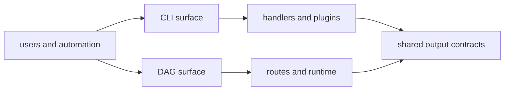

# Runtime Surfaces

`bijux-core` publishes two runtime families that readers and automation can
interact with directly:

- `bijux`, the operator-facing CLI
- `bijux-dag`, the local-first DAG runtime and command surface

They are built from different crates, but they are not unrelated products.
They share repository-level rules around configuration, output honesty,
contract drift, and release proof. This page maps the public runtime surfaces
without collapsing them into one blurred interface.

## Surface Map

## The Public Runtime Boundary

### `bijux`

The `bijux` surface is where operators and automation manage command routing,
configuration layering, plugin lifecycle, and user-facing diagnostics.

Readers should expect `bijux` docs and output to answer questions such as:

- which command owns this operation
- which configuration source supplied a value
- what happened during plugin install, inspect, or removal
- whether a failure is recoverable, user-correctable, or a repository bug

### `bijux-dag`

The `bijux-dag` surface is where DAG authors and automation validate,
execute, inspect, replay, diff, and retain workflow evidence.

Readers should expect `bijux-dag` docs and output to answer questions such as:

- what the runtime executed
- which nodes succeeded, failed, skipped, or were blocked
- what evidence was retained in the run directory
- how replay, diff, and status commands interpret that retained state

### Shared contract layer

Although the commands differ, both surfaces still depend on common repository
rules:

- machine-readable outputs must preserve the same meaning as human-readable ones
- reason codes and status vocabularies must stay stable once documented
- public examples and generated references must track the shipped binaries
- release evidence must reflect what the runtime actually supports

## Surface Contract

- CLI surfaces provide command routing, plugin lifecycle, and config behavior
- DAG surfaces provide validate, run, replay, diff, status, and inspect flows
- output envelopes must keep machine and human formats semantically aligned
- command behavior changes require corresponding docs and compatibility evidence

## What This Page Separates Clearly

This page helps distinguish questions that often get mixed together:

- a CLI routing problem is not the same thing as a DAG execution problem
- a runtime engine change is not complete if it breaks output contracts
- a human-facing explanation is not enough if machine-readable meaning drifted
- a crate-local implementation detail is not automatically a public runtime surface

## Surface Non-Goals

- no silent alias behavior that bypasses canonical route handling
- no runtime-only shortcuts that produce undocumented output schemas
- no cross-surface drift between machine-readable and human-readable meaning

## Where Each Surface Starts In Code

- `crates/bijux-cli/src/bin/bijux.rs`
- `crates/bijux-dag-cli/src/main.rs`
- `crates/bijux-dag-app/src/routes/mod.rs`
- `crates/bijux-dag-runtime/src/lib.rs`

Those anchors matter because public runtime behavior is defined by more than
one crate. The CLI binary, route layer, and runtime engine each own part of the
delivered surface.

## Useful Review Questions

1. does this change alter public command meaning?
2. does it change output schema or reason-code vocabulary?
3. are docs and contract tests updated in the same change set?
4. is the behavior truly public, or only an internal crate detail?

## Next Reads

- [State and Configuration](state-and-configuration.md)
- [Artifact and Contract Flow](artifact-and-contract-flow.md)
- [Compatibility and Schema](../governance/compatibility-and-schema.md)
- [Release and Versioning](../operations/release-and-versioning.md)
