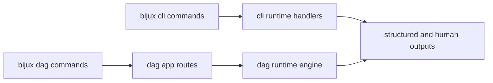

# Runtime Surfaces

Runtime surfaces define how users and automation interact with CLI and DAG
behavior while preserving shared contracts.

## Visual Summary

## Surface Contract

- CLI surfaces provide command routing, plugin lifecycle, and config behavior
- DAG surfaces provide validate, run, replay, diff, status, and inspect flows
- output envelopes must keep machine and human formats semantically aligned
- command behavior changes require corresponding docs and compatibility evidence

## Code Anchors

- `crates/bijux-cli/src/main.rs`
- `crates/bijux-dag-cli/src/main.rs`
- `crates/bijux-dag-app/src/routes/mod.rs`
- `crates/bijux-dag-runtime/src/lib.rs`

## Next Reads

- [State and Configuration](state-and-configuration.md)
- [Compatibility and Schema](../governance/compatibility-and-schema.md)
- [Release and Versioning](../governance/release-and-versioning.md)
