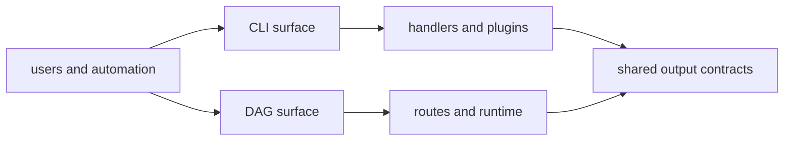

# Runtime Surfaces

This page explains the public runtime surfaces that `bijux-core` exposes.

The important boundary is not just between commands. It is between user-facing
behavior, DAG execution behavior, and the shared contracts that keep their
outputs understandable to both people and automation.

## Surface Map

## Surface Contract

- CLI surfaces provide command routing, plugin lifecycle, and config behavior
- DAG surfaces provide validate, run, replay, diff, status, and inspect flows
- output envelopes must keep machine and human formats semantically aligned
- command behavior changes require corresponding docs and compatibility evidence

## Surface Non-Goals

- no silent alias behavior that bypasses canonical route handling
- no runtime-only shortcuts that produce undocumented output schemas
- no cross-surface drift between machine-readable and human-readable meaning

## Review Questions

1. does this change alter public command meaning?
2. does it change output schema or reason-code vocabulary?
3. are docs and contract tests updated in the same change set?

## Reading Rule

Use this page when the question is which runtime-facing surface a behavior
belongs to before drilling into CLI or DAG specifics.

## Code Anchors

- `crates/bijux-cli/src/main.rs`
- `crates/bijux-dag-cli/src/main.rs`
- `crates/bijux-dag-app/src/routes/mod.rs`
- `crates/bijux-dag-runtime/src/lib.rs`

## Next Reads

- [State and Configuration](state-and-configuration.md)
- [Compatibility and Schema](../governance/compatibility-and-schema.md)
- [Release and Versioning](../governance/release-and-versioning.md)
