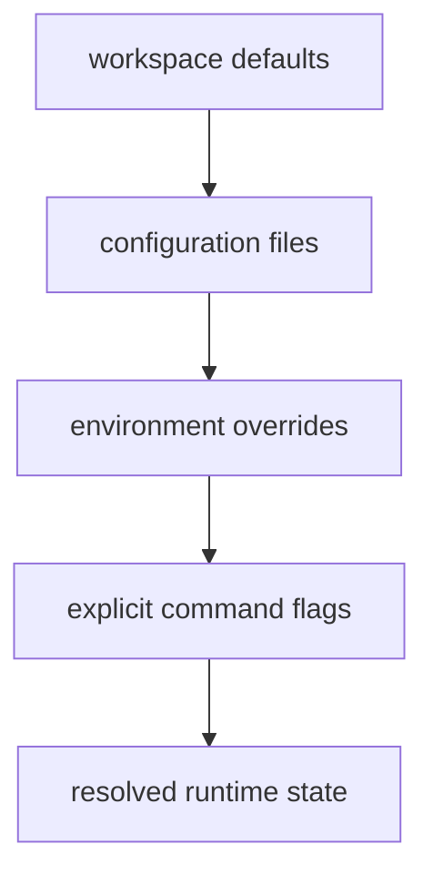

# State and Configuration

State and configuration should be resolved deterministically so command behavior
is reproducible and diagnosable.

## Visual Summary

## Resolution Rules

- default values provide a stable baseline for local and CI runs
- config files declare persistent preferences and scoped paths
- environment overrides are explicit and auditable in automation
- flags are highest precedence and apply per invocation

## State Ownership

- CLI state files are owned by CLI runtime contracts
- DAG run state and artifact records are owned by DAG runtime and artifact crates
- maintainer evidence state is generated, reviewable, and disposable

## Code Anchors

- `crates/bijux-cli/src/config/`
- `crates/bijux-dag-runtime/src/config.rs`
- `crates/bijux-dag-artifacts/src/storage/`
- `crates/bijux-dev/src/commands/shared_io.rs`

## Next Reads

- [Artifact and Contract Flow](artifact-and-contract-flow.md)
- [Testing and Validation](../governance/testing-and-validation.md)
- [Risk and Exceptions](../governance/risk-and-exceptions.md)
