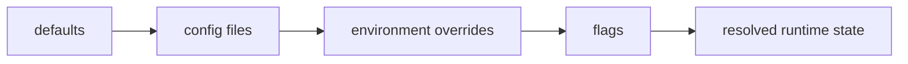

# State and Configuration

`bijux-core` resolves runtime behavior from a layered set of defaults, files,
environment variables, and invocation-time flags. That layering is deliberate:
operators need local convenience, automation needs explicit overrides, and both
need the same precedence rules every time.

When these rules are clear, a reader can answer practical questions quickly:

- why a command used one value instead of another
- where a persisted state file should live
- which part of the repository owns retained run metadata
- whether a surprising behavior is configuration drift or a code defect

## Resolution Flow

## Configuration Precedence

The repository resolves runtime state in a stable order:

- default values provide a stable baseline for local and CI runs
- config files declare persistent preferences and scoped paths
- environment overrides are explicit and auditable in automation
- flags are highest precedence and apply per invocation

That order matters because it makes the final runtime view explainable. The
reader should not have to guess whether a value came from a file, an exported
variable, or a one-off command flag.

## What Counts As Configuration

The configuration layer usually answers questions about intent before execution
starts, such as:

- profile and path selection
- artifact locations
- plugin and CLI behavior toggles
- runtime backend choices and execution options
- environment requirements that must be declared before a run

## What Counts As State

State is the data created or retained while the repository is operating:

- CLI state files and resolved config views
- DAG run directories and manifests
- artifact storage records
- maintainer evidence and generated reports

Configuration tells the runtime what to do. State records what it did.

## Ownership By Surface

- CLI state files are owned by CLI runtime contracts
- DAG run state and artifact records are owned by DAG runtime and artifact crates
- maintainer evidence state is generated, reviewable, and disposable

That split prevents one product family from accidentally becoming the hidden
owner of another surface's retained data.

## Why Stable Precedence Matters

Without fixed precedence, the same command can behave differently across local
development, CI, and release automation for reasons that are hard to recover
after the fact. Stable precedence gives the repository three durable benefits:

- reproducible local debugging
- auditable CI and release execution
- clearer failure reports when required configuration is missing or invalid

## Common Reader Questions

### "Why did this invocation pick that value?"

Start by checking whether the value was supplied by:

1. a command-line flag
2. an environment override
3. a repository or user config file
4. the built-in default

### "Who owns this retained file?"

If the file explains a DAG run, artifact, or manifest, the owning surface is
usually in the DAG runtime and artifact crates. If it explains command
configuration or CLI behavior, the owning surface is usually in the CLI crate.

### "Should this be committed?"

Most generated or retained state belongs in governed artifact locations, not in
tracked source. Source defines the rules; runtime state proves a run.

## Code Anchors

- `crates/bijux-cli/src/features/config/`
- `crates/bijux-dag-runtime/src/internal/control/config.rs`
- `crates/bijux-dag-artifacts/src/storage/`
- `crates/bijux-dev/src/commands/shared_io.rs`

## State Ownership References

- [Artifact and Contract Flow](artifact-and-contract-flow.md)
- [Testing and Validation](../operations/testing-and-validation.md)
- [Risk and Exceptions](../governance/risk-and-exceptions.md)
