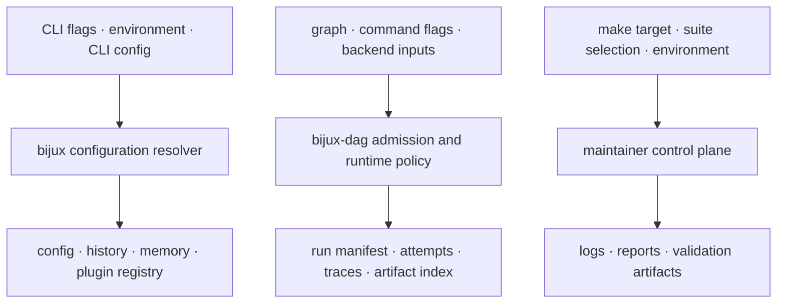

# State and Configuration

Configuration and state are owned by the product that interprets them.
`bijux`, `bijux-dag`, and maintainer automation do not share a hidden global
configuration object or a common persistence transaction.

## Ownership Topology

Each resolver must explain its own effective inputs. Similar names across
products do not create shared precedence or shared persistence ownership.

## Configuration Boundaries

| Surface | Configuration authority | Persisted state | Diagnostic authority |
| --- | --- | --- | --- |
| `bijux` | CLI defaults, compatibility file, environment, and applicable flags under the CLI precedence contract | user configuration, history, memory, plugin content, and registry | `bijux cli paths`, `config explain`, `status`, `doctor`, and `audit` |
| `bijux-dag` | graph contract, command arguments, execution policy, and backend-specific inputs | rooted run directory, attempts, traces, declared artifacts, and integrity records | plan, inspect, explain, verify, backend diagnostics, and retained run evidence |
| repository maintenance | make target, suite catalog, environment, generated policy, and explicit command options | outputs under `artifacts/` or an explicitly governed report destination | maintainer command envelope, component logs, aggregate status, and evidence manifest |

The CLI's exact path and value precedence is documented in
[CLI State and Persistence](../../bijux-cli/architecture/state-and-persistence.md)
and [Configuration Surface](../../bijux-cli/interfaces/configuration-surface.md).
The DAG graph, run, and backend inputs are documented in the
[DAG Execution Model](../../bijux-dag/architecture/execution-model.md) and
[Run Evidence Layout](../../bijux-dag/interfaces/run-evidence-layout.md).

## Configuration Versus Evidence

Configuration states intent before effects. State records what an owner
retained during or after effects. Evidence is the subset of state that carries
enough identity, status, provenance, and integrity to support a bounded claim.
A file does not become evidence merely because it was written under a run or
artifact directory.

## Cross-Surface Rules

- Record effective inputs when reproducibility or incident analysis depends on
  them; do not infer configuration from defaults after the run.
- Keep CLI user state separate from DAG run roots and repository validation
  artifacts.
- Do not treat environment variables as provenance unless their names, values,
  redaction rules, and owner are deliberately captured.
- Generated local state belongs under `artifacts/` unless a repository-owned
  producer explicitly governs a checked-in destination.
- State repair remains an operation of the owning product; deleting or
  rewriting another product's files is not recovery.

## Code Anchors

- `crates/bijux-cli/src/features/config/`
- `crates/bijux-dag-runtime/src/internal/control/config.rs`
- `crates/bijux-dag-artifacts/src/storage/`
- `crates/bijux-dev/src/commands/shared_io.rs`

## State Ownership References

- [Artifact and Contract Flow](artifact-and-contract-flow.md)
- [Testing and Validation](../operations/testing-and-validation.md)
- [Risk and Exceptions](../governance/risk-and-exceptions.md)
