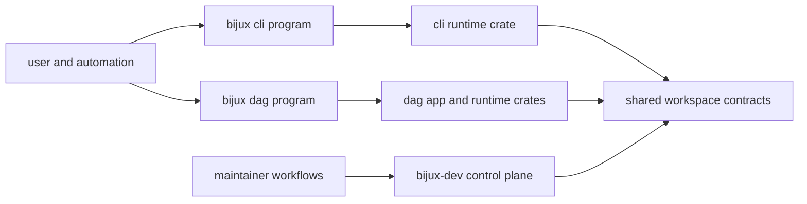

# System Overview

`bijux-core` is a single Rust workspace that hosts runtime programs, DAG
execution crates, a Python bridge package, and a maintainer control-plane.

## Visual Summary

## System Components

- `crates/bijux-cli` owns CLI runtime behavior
- `crates/bijux-dag-*` owns DAG execution, replay, diff, and artifacts
- `crates/bijux-cli-python` owns Python packaging and bridge integration
- `crates/bijux-dev` owns maintainer-only diagnostics and governance workflows

## Architectural Boundary

- runtime behavior belongs to CLI and DAG program crates
- repository policy and release evidence belong to maintainer workflows
- shared workspace policy belongs to root manifests, configs, and make targets

## Code Anchors

- `Cargo.toml`
- `crates/bijux-cli/src/lib.rs`
- `crates/bijux-dag-app/src/lib.rs`
- `crates/bijux-dev/src/lib.rs`

## Next Reads

- [Workspace Topology](workspace-topology.md)
- [Dependency Direction](dependency-direction.md)
- [Repository Scope](../governance/repository-scope.md)
