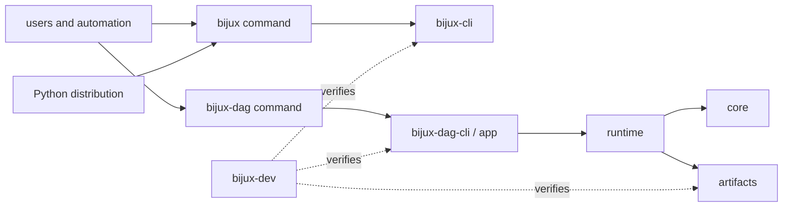

# System Overview

`bijux-core` is one release-governed Rust workspace with distinct runtime and
proof boundaries. The repository structure is intended to make a behavior
traceable from its public entrypoint to its owner, retained evidence, and
release check.

## Ownership Map

Solid arrows are runtime or distribution relationships. Dotted arrows are
maintainer observation and verification; they must not become product runtime
dependencies.

## Owned Surfaces

| Surface | Owner | Stable responsibility | Does not own |
| --- | --- | --- | --- |
| `bijux` command | `bijux-cli` | routing, command execution, envelopes, state, diagnostics, and plugin lifecycle | DAG execution or repository governance |
| Python `bijux-cli` distribution | `bijux-cli-python` | packaging, bridge conversion, launcher behavior, and mounted Python app integration | independent CLI or DAG semantics |
| graph semantics | `bijux-dag-core` | graph types, validation, identity, planning inputs, and domain errors | process execution or persistence |
| run evidence | `bijux-dag-artifacts` | run directories, manifests, integrity, import/export, and artifact lookup | scheduling decisions |
| execution | `bijux-dag-runtime` | planning, scheduling, backends, replay inputs, and runtime state transitions | command presentation |
| DAG orchestration | `bijux-dag-app` and `bijux-dag-cli` | route composition, response envelopes, and executable entrypoint | core graph semantics |
| repository proof | `bijux-dev` | policy checks, generated evidence, release verification, and diagnostics | user-facing runtime behavior |

The authoritative public/private classification and publish order live in
`contracts/foundation/workspace_package_boundary.v1.json`, not in this table.

## Change Flow

A public behavior change should move through the repository in this order:

1. Change the behavior in its owning product crate.
2. Update schemas, prose specifications, snapshots, or fixtures that govern
   the affected contract.
3. Run the focused owning tests and the cross-surface contract tests.
4. Regenerate checked-in references or evidence from their owning commands.
5. Update the relevant handbook and package README.
6. Include the affected product in release verification.

This is a consistency rule, not a requirement to modify every layer for every
change. A private implementation change stops at the layer whose externally
observable behavior remains unchanged.

## Boundary Decisions

### Runtime code needs repository information

Prefer a stable contract, generated asset, or explicit input. Do not import
`bijux-dev` to obtain repository state from a product crate.

### Maintainer tooling needs product information

Consume public product queries, schemas, or read-only contracts. Maintainer
code may inspect product facts; it must not become the alternate implementation
of those facts.

### Two products need similar behavior

First determine whether the behavior is truly one contract. Shared vocabulary
or serialization may belong in a narrow authority. Similar command names alone
do not justify coupling CLI and DAG runtime implementations.

### A generated report disagrees with code

Treat the report as stale until the producer and source contract are checked.
Generated evidence records an observation; it cannot override implementation
or schema authority.

## Where To Verify The Model

- `Cargo.toml` defines workspace membership and shared package policy.
- `contracts/foundation/workspace_package_boundary.v1.json` classifies package
  ownership and publication.
- `crates/bijux-dev/tests/foundation_workspace_package_boundary_contracts.rs`
  checks the classification against Cargo metadata.
- `crates/bijux-dev/tests/docs_source_reference_contracts.rs` checks source
  references in governed documentation.
- `mkdocs.yml` defines the curated public handbook rather than publishing every
  internal contract and report.

## Continue Reading

- [Dependency Direction](dependency-direction.md)
- [Artifact and Contract Flow](artifact-and-contract-flow.md)
- [Documentation System](../foundation/documentation-system.md)
- [Architecture Risks](architecture-risks.md)
