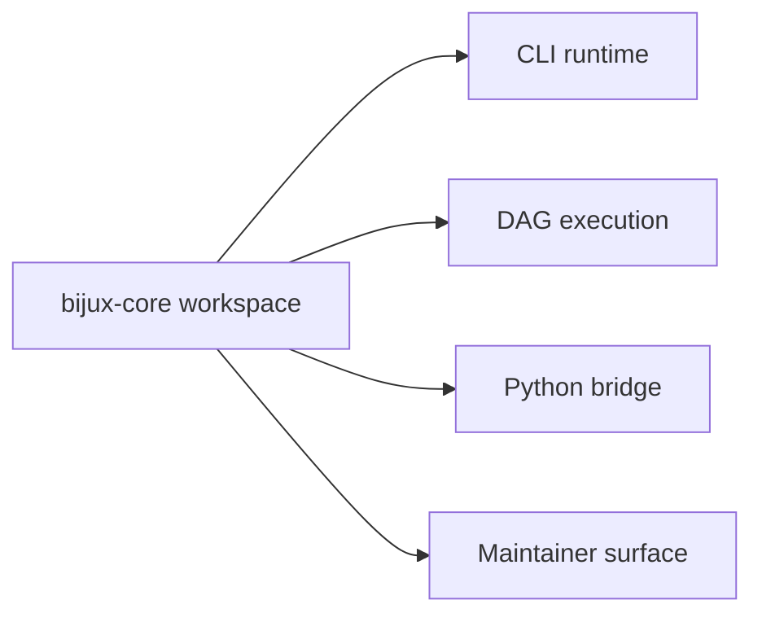

# System Overview

`bijux-core` is a single Rust workspace that hosts the command runtime, the DAG
execution system, a Python bridge package, and the repository machinery that
governs them together.

## Workspace Map

## System Components

- `crates/bijux-cli` owns CLI runtime behavior
- `crates/bijux-dag-core`, `crates/bijux-dag-artifacts`, `crates/bijux-dag-runtime`,
  `crates/bijux-dag-app`, and `crates/bijux-dag-cli` own DAG execution,
  replay, diff, and artifacts
- `crates/bijux-cli-python` owns Python packaging and bridge integration
- `crates/bijux-dev` owns maintainer-only diagnostics and governance workflows

## Architectural Boundary

- runtime behavior belongs to CLI and DAG program crates
- repository policy and release evidence belong to maintainer workflows
- shared workspace policy belongs to root manifests, configs, and make targets

## Reading Rule

Use this page to understand the whole workspace first. Move to Workspace
Topology and Dependency Direction when the next question is about crate layout
or one-way dependency rules.

## Non-Goals

- this page does not define command-by-command CLI behavior
- this page does not redefine DAG runtime semantics already owned by DAG docs
- this page does not replace executable contract and test evidence

## Boundary Smells

- adding maintainer-only logic into user runtime crates
- changing product behavior through repository scripts without crate-level review
- documenting cross-program policy without linking owning code anchors

## Code Anchors

- `Cargo.toml`
- `crates/bijux-cli/src/lib.rs`
- `crates/bijux-dag-app/src/lib.rs`
- `crates/bijux-dev/src/lib.rs`

## Next Reads

- [Workspace Topology](workspace-topology.md)
- [Dependency Direction](dependency-direction.md)
- [Repository Scope](../governance/repository-scope.md)
