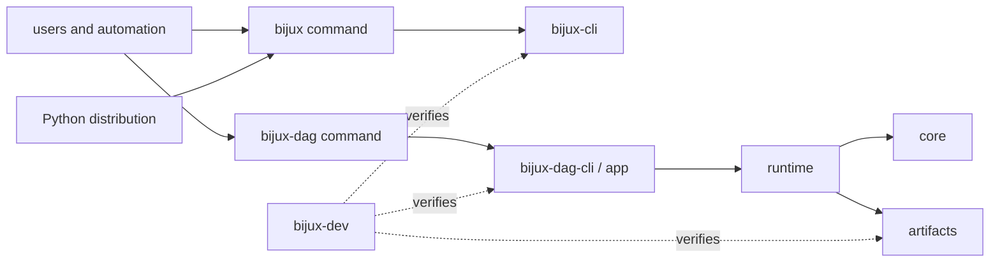
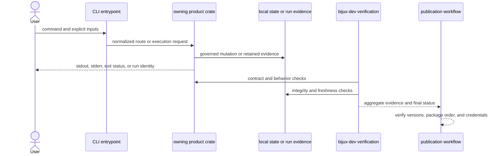
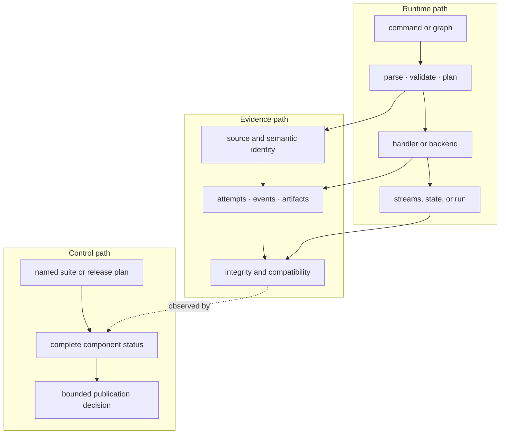

# System Overview

`bijux-core` is one release-governed Rust workspace with distinct runtime and
proof boundaries. The repository structure is intended to make a behavior
traceable from its public entrypoint to its owner, retained evidence, and
release check.

The architecture separates three planes:

- the **product plane** parses, validates, executes, and reports user work;
- the **evidence plane** retains run facts and evaluates governed scenarios;
- the **release plane** decides whether packages and claims may be published.

Information flows upward as structured facts. Product behavior never calls
back into release tooling to decide what it means.

## Ownership Map

Solid arrows are runtime or distribution relationships. Dotted arrows are
maintainer observation and verification; they must not become product runtime
dependencies.

## End-To-End Responsibility

The first response is a product outcome. The later verification path is a
release decision. Keeping them distinct prevents a maintainer-only success
from masquerading as runtime support.

## Owned Surfaces

| Surface | Owner | Stable responsibility | Does not own |
| --- | --- | --- | --- |
| `bijux` command | `bijux-cli` | routing, command execution, envelopes, state, diagnostics, and plugin lifecycle | DAG execution or repository governance |
| Python `bijux-cli` distribution | `bijux-cli-python` | packaging, bridge conversion, launcher behavior, and mounted Python app integration | independent CLI or DAG semantics |
| graph semantics | `bijux-dag-core` | graph types, validation, identity, planning inputs, and domain errors | process execution or persistence |
| run evidence | `bijux-dag-artifacts` | run directories, manifests, integrity, import/export, and artifact lookup | scheduling decisions |
| execution | `bijux-dag-runtime` | planning, scheduling, backends, replay inputs, and runtime state transitions | command presentation |
| DAG orchestration | `bijux-dag-app` and `bijux-dag-cli` | route composition, response envelopes, and executable entrypoint | core graph semantics |
| repository proof | `bijux-dev` | policy checks, generated evidence, release verification, and diagnostics | user-facing runtime behavior |

The authoritative public/private classification and publish order live in
`contracts/foundation/workspace_package_boundary.v1.json`, not in this table.

## Runtime, Evidence, And Control Paths

These paths meet through data, not callbacks into maintainer policy. The
runtime owns behavior; evidence binds observations to that behavior; the
control plane selects and evaluates proof. A release workflow may reject a
runtime claim, but the product never imports release tooling to decide its own
semantics.

## Capacity And External Authority

The architecture contains real scheduling and operational depth without
claiming an unlimited control plane:

| Concern | Repository-owned mechanism | External or bounded assumption |
| --- | --- | --- |
| CLI throughput | one invocation has deterministic routing, output, and state contracts | no multi-tenant CLI service or global rate limiter |
| DAG parallelism | ready-frontier scheduling, worker count, CPU, memory, GPU, named-resource, and queue limits | capacity is configured for one controller and its selected backend |
| process isolation | child-process boundaries, environment shaping, timeout, cancellation, and output authorization | host permissions and subprocess behavior remain OS concerns |
| container isolation | validated mounts, engine-specific no-network flags, and image policy | Docker or Podman supplies the actual isolation boundary |
| batch execution | bounded SLURM and Kubernetes adapters reconcile scheduler observations into controller-owned state | shared storage and cluster access are operator-supplied |
| release mutation | dependency-ordered, registry-specific publication with retained identities | registries and deployment services retain external state |

Scale claims therefore belong to named scenarios and retained measurements.
They are not inferred from the presence of concurrency controls or a backend
adapter.

## Change Flow

A public behavior change should move through the repository in this order:

1. Change the behavior in its owning product crate.
2. Update schemas, prose specifications, snapshots, or fixtures that govern
   the affected contract.
3. Run the focused owning tests and the cross-surface contract tests.
4. Regenerate checked-in references or evidence from their owning commands.
5. Update the relevant handbook and package README.
6. Include the affected product in release verification.

This is a consistency rule, not a requirement to modify every layer for every
change. A private implementation change stops at the layer whose externally
observable behavior remains unchanged.

## Boundary Decisions

### Runtime code needs repository information

Prefer a stable contract, generated asset, or explicit input. Do not import
`bijux-dev` to obtain repository state from a product crate.

### Maintainer tooling needs product information

Consume public product queries, schemas, or read-only contracts. Maintainer
code may inspect product facts; it must not become the alternate implementation
of those facts.

### Two products need similar behavior

First determine whether the behavior is truly one contract. Shared vocabulary
or serialization may belong in a narrow authority. Similar command names alone
do not justify coupling CLI and DAG runtime implementations.

### A generated report disagrees with code

Treat the report as stale until the producer and source contract are checked.
Generated evidence records an observation; it cannot override implementation
or schema authority.

## Failure Containment

| Failure domain | Contained by | Must remain visible as |
| --- | --- | --- |
| CLI parse or route error | command boundary | classified stderr, stable exit status, and bounded suggestion |
| plugin process failure | delegated process boundary | original streams and delegated exit status |
| graph validation failure | DAG core boundary | structured validation errors before execution |
| node attempt failure | runtime state machine | attempt trace, terminal node status, and dependency consequences |
| artifact integrity failure | artifact boundary | verification refusal; never a reusable cache or replay proof |
| maintainer suite failure | aggregate gate | nonzero final status and complete component results |
| publication failure | registry-specific release operation | partial-publication inventory and incident response |

Containment does not mean suppression. Every boundary prevents a failure from
being reclassified as success while preserving enough context to locate its
owner.

## Where To Verify The Model

- `Cargo.toml` defines workspace membership and shared package policy.
- `contracts/foundation/workspace_package_boundary.v1.json` classifies package
  ownership and publication.
- `crates/bijux-dev/tests/foundation_workspace_package_boundary_contracts.rs`
  checks the classification against Cargo metadata.
- `crates/bijux-dev/tests/docs_source_reference_contracts.rs` checks source
  references in governed documentation.
- `mkdocs.yml` defines the curated public handbook rather than publishing every
  internal contract and report.

## Apply The Model

Before accepting a cross-crate change, route each open question to one
authority:

| Question | Authority |
| --- | --- |
| Is this dependency allowed to point at that package? | [Dependency Direction](dependency-direction.md) |
| Which schema, snapshot, report, and handbook must move with the behavior? | [Artifact and Contract Flow](artifact-and-contract-flow.md) |
| Is this text a public explanation, executable specification, or generated observation? | [Documentation System](../foundation/documentation-system.md) |
| Which unresolved structural failure could invalidate the release claim? | [Architecture Risks](architecture-risks.md) |

The review is incomplete when one behavior has several apparent owners or when
the only proof is prose. Resolve ownership first, then require evidence from the
layer that can actually detect the defect.
