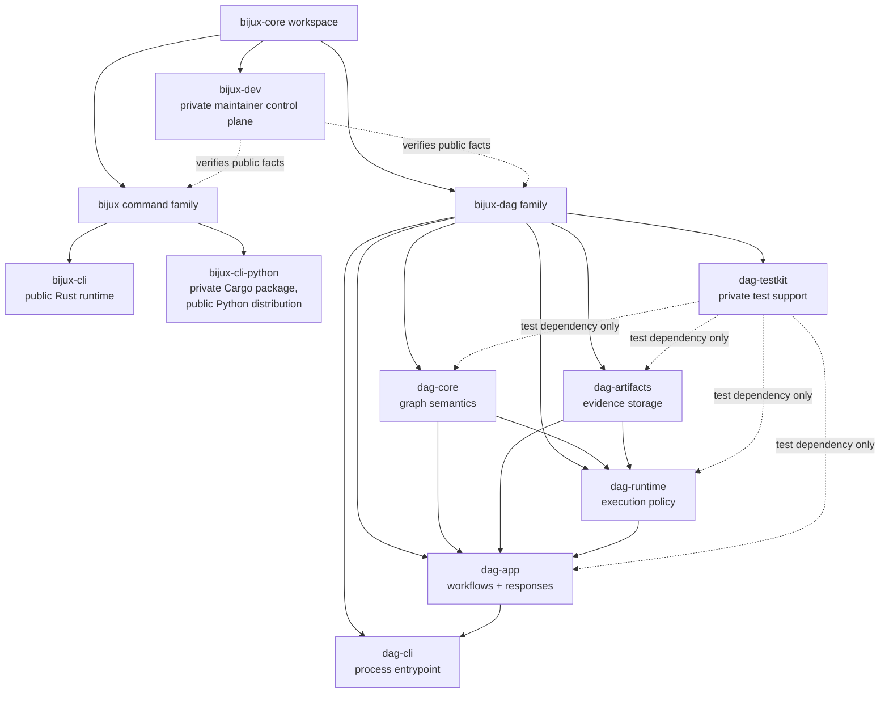
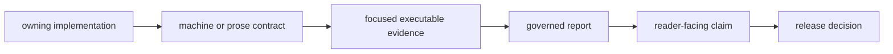

# Workspace Topology

`bijux-core` is one release workspace, not one runtime. It contains the `bijux`
command family, the `bijux-dag` workflow family, private test and maintainer
support, executable contracts, and generated evidence. Shared release
governance does not permit one family to absorb another's behavior.

## Product And Support Topology

The dotted edges are support and verification relationships, not production
dependency permission. Public packages must not require `bijux-dev` or
`bijux-dag-testkit` to build or run.

## Repository Zones

| Zone | Authority | What belongs there | What does not |
| --- | --- | --- | --- |
| `crates/` | package manifests and crate contracts | product implementation, private support packages, package tests, crate-local engineering docs | cross-repository policy or run output |
| `contracts/` | machine-readable contract registries | stable package, command, release, and compatibility facts consumed by checks | prose-only guidance or local observations |
| `configs/` | tool and suite configuration | lint, test, policy, schema, benchmark, and release inputs | generated results |
| the four product and maintainer handbook roots | curated public handbooks | reader decisions, supported boundaries, workflows, architecture, limitations | generated reports and executable specifications |
| `docs/spec/` | executable specification authority | normative cross-package contracts read or checked by tooling | tutorials or ungoverned proposals |
| `docs/reports/` | governed evidence | checked observations, ledgers, inventories, and review reports with identifiable producers or validation | source contracts disguised as results |
| `makes/` and `Makefile` | repository command entrypoints | composable development, test, documentation, and release routes | hidden product logic |
| `.bijux/shared/` | synchronized `bijux-std` content | consumed shared standards | downstream hand edits |
| `artifacts/` | disposable local output | builds, logs, test results, generated sites, temporary run evidence | committed authority |

## Choose An Owner

| Change | First owner |
| --- | --- |
| root command parsing, plugin behavior, configuration, REPL, or Python launcher | `bijux-cli` family |
| graph identity, validation, canonicalization, or planning semantics | `bijux-dag-core` |
| run paths, manifests, indexes, digests, lineage, retention, or bundle storage | `bijux-dag-artifacts` |
| scheduling, retries, backends, cache decisions, replay execution, or runtime state | `bijux-dag-runtime` |
| DAG command workflow, application service, inspection, or response schema | `bijux-dag-app` |
| `bijux-dag` process wiring and completion generation | `bijux-dag-cli` |
| deterministic cross-crate fixtures and assertions | `bijux-dag-testkit` |
| repository checks, release evidence, generated governance reports, or suite composition | `bijux-dev` |

Cross-package work can require several owners, but it still needs one authority
for each fact. Shared helper placement must follow dependency direction rather
than convenience.

## Authority Flow

A report summarizes evidence; it cannot rewrite the contract. A handbook
explains supported behavior; it cannot promote an internal route. Local
artifacts prove only the source revision and environment recorded with them.

## Structural Gates

The public site is curated through `mkdocs.yml`. `make
docs-publication-check` enforces a 40-to-100-page navigation budget, excludes
`docs/spec/` and `docs/reports/`, and prevents public handbook paths deeper than
product/category/page. Crate-local `docs/` directories remain internal and are
limited by repository documentation governance.

## Next Reads

- [Dependency Direction](dependency-direction.md)
- [Runtime Surfaces](runtime-surfaces.md)
- [Package Boundary](../foundation/package-boundary.md)
- [Documentation System](../foundation/documentation-system.md)
