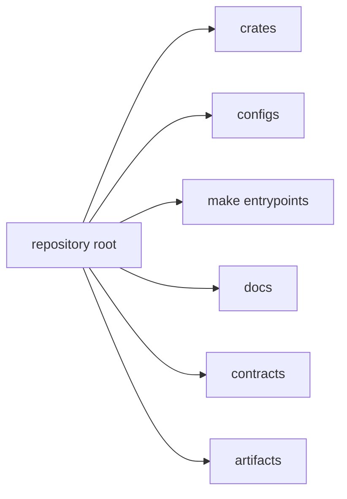

# Workspace Topology

This page explains how the major repository surfaces fit together.

It is a navigation aid first. The topology is useful when a reader needs to see
how source code, contracts, docs, and generated outputs relate before diving
into one branch.

## Topology Map

## Topology Rules

- product and maintainer code lives under `crates/`
- shared build and test configuration lives under `configs/`
- orchestration entrypoints live under `makes/` and root `Makefile`
- handbook content lives under `docs/` with four top-level programs
- generated outputs stay under `artifacts/` and never become source of truth

## Documentation Programs

- `docs/bijux-core`
- `docs/bijux-cli`
- `docs/bijux-dag`
- `docs/bijux-dev`

## Reading Rule

Use this page when the repository surface is still unfamiliar and the question
is where a concern lives before asking how it works.

## Code Anchors

- `Cargo.toml`
- `Makefile`
- `makes/root.mk`
- `docs/index.md`

## Next Reads

- [Runtime Surfaces](runtime-surfaces.md)
- [Package Ownership](../governance/package-ownership.md)
- [Documentation Standards](../governance/documentation-standards.md)
