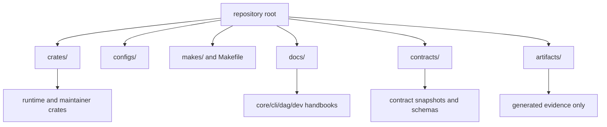

# Workspace Topology

Workspace topology documents where source, policies, contracts, and generated
assets live so contributors can navigate without guesswork.

## Visual Summary

## Topology Rules

- product and maintainer code lives under `crates/`
- shared build and test configuration lives under `configs/`
- orchestration entrypoints live under `makes/` and root `Makefile`
- handbook content lives under `docs/` with four top-level programs
- generated outputs stay under `artifacts/` and never become source of truth

## Documentation Programs

- `docs/bijux-core`
- `docs/bijux-cli`
- `docs/bijux-dag`
- `docs/bijux-dev`

## Code Anchors

- `Cargo.toml`
- `Makefile`
- `makes/root.mk`
- `docs/index.md`

## Next Reads

- [Runtime Surfaces](runtime-surfaces.md)
- [Package Ownership](../governance/package-ownership.md)
- [Documentation Standards](../governance/documentation-standards.md)
