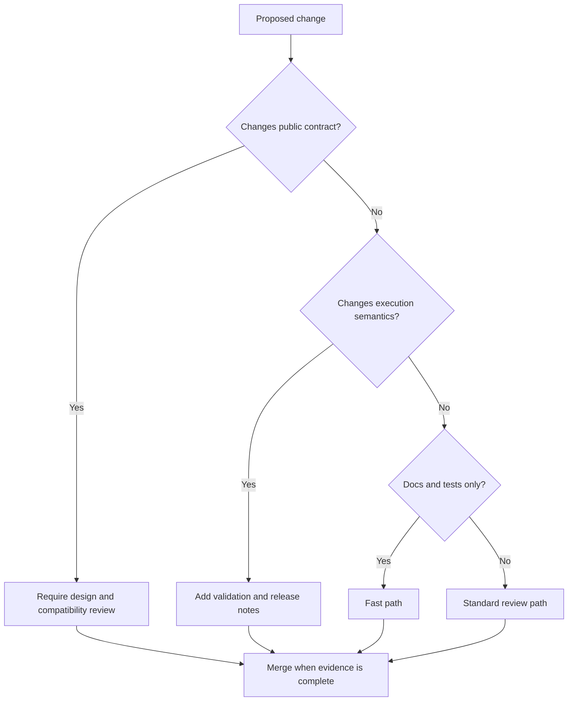

# Change Principles

Repository changes should make ownership clearer, not blurrier. The handbook
model matters because it keeps readers from debugging organizational drift by
hand.

## Principles

- prefer stable names over migration-era labels
- change one ownership boundary at a time and document it explicitly
- update docs in the same change that changes behavior or structure
- keep repository rules small enough that product handbooks can stay honest

## Repository Smells

- root docs duplicating product detail
- one-off section names that break handbook symmetry without good reason
- automation surfaces that exist in files but not in the handbook

## Next Reads

- [Decision Rules](decision-rules.md)
- [Change Management](../operations/change-management.md)
- [Documentation Standards](../governance/documentation-standards.md)
