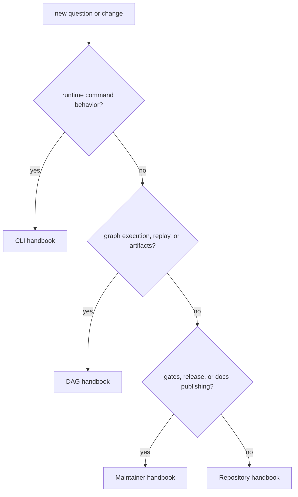

# Decision Rules

The fastest way to get lost in `bijux-core` is to start in the wrong handbook
and stay there too long. Most confusion in this repository is not about code
first. It is about picking the wrong level of ownership.

This page is the routing map for that first decision. It tells readers whether
their question belongs with the operator CLI, the DAG runtime, the maintainer
surface, or the repository itself.

## Routing Map

## The Four Real Owners

### `bijux`

Stay with the CLI handbook when the question is about what an operator-facing
command does, how configuration is resolved, how plugins behave, or how the
CLI explains success and failure.

Typical examples:

- command routing and flags
- plugin install, inspect, and removal behavior
- CLI configuration and persisted state
- human-readable and machine-readable output from `bijux`

### `bijux-dag`

Stay with the DAG handbook when the question is about graph meaning, workflow
execution, retained run evidence, replay, diff, verification, or operator DAG
workflows.

Typical examples:

- what a run directory contains
- how trigger rules behave
- replay identity and diff semantics
- backend behavior during DAG execution

### `bijux-dev`

Stay with the maintainer handbook when the question is about repository proof,
CI gates, release automation, docs publishing, evidence generation, or other
maintainer-only surfaces.

Typical examples:

- which gate enforces a policy
- how release evidence is produced
- how documentation publication is verified
- which internal command generates a report

### `bijux-core`

Stay in the repository handbook only when the answer truly crosses product or
package boundaries.

That usually means:

- the question touches both `bijux` and `bijux-dag`
- the answer depends on workspace layout, shared contracts, or release rules
- root-level docs, contracts, or automation entrypoints are involved
- ownership itself is the thing that still needs to be settled

## Routing Rules

- if the question is about runtime command behavior, go to [CLI](../../bijux-cli/index.md)
- if the question is about graph execution, replay, or artifacts, go to
  [DAG](../../bijux-dag/index.md)
- if the question is about repository gates, docs publishing, or release
  control, go to [Maintainer](../../bijux-dev/index.md)
- if two branches both seem to own the answer, stay in the repository handbook
  until the ownership conflict is resolved

## When To Escalate Back To The Repository Handbook

- the change affects more than one product handbook
- the question involves root files or shared automation
- the docs tree itself is inconsistent

## Common Misroutes

- treating a release or governance question as if it were only a crate problem
- explaining DAG behavior from a repository page instead of the DAG handbook
- explaining maintainer-only automation from a product page
- keeping a reader in `bijux-core` after the real owner is already obvious

## A Practical Shortcut

If one handbook can answer the question honestly by itself, that handbook owns
the answer. Repository pages exist for shared boundaries, not as a more
important layer above product docs.

## Next Reads

- [Package Map](package-map.md)
- [Repository Scope](repository-scope.md)
- [Repository Handbook](../index.md)
- [Maintainer Handbook](../../bijux-dev/index.md)
