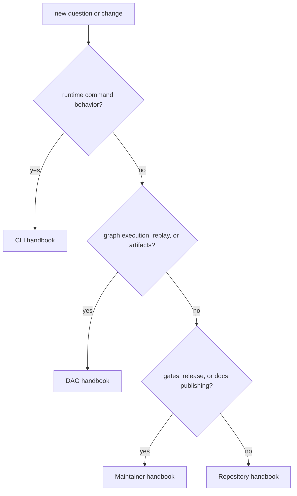

# Decision Rules

This page explains how the repository routes questions before code changes even
start.

Good routing removes guesswork. The point is to land in the owning handbook
fast enough that the rest of the repository stops feeling larger than it is.

## Routing Map

## Routing Rules

- if the question is about runtime command behavior, go to [CLI](../../bijux-cli/index.md)
- if the question is about graph execution, replay, or artifacts, go to
  [DAG](../../bijux-dag/index.md)
- if the question is about repository gates, docs publishing, or release
  control, go to [Maintainer](../../bijux-dev/index.md)
- if two branches both seem to own the answer, stay in the repository handbook
  until the ownership conflict is resolved

## Escalate To The Repository Handbook When

- the change affects more than one product handbook
- the question involves root files or shared automation
- the docs tree itself is inconsistent

## Reading Rule

Use this page when ownership is still ambiguous. Once the answer lands clearly
in one handbook, move there and stay off the repository branch unless the
boundary shifts again.

## Next Reads

- [Package Map](package-map.md)
- [Repository Handbook](../index.md)
- [Maintainer Handbook](../../bijux-dev/index.md)
