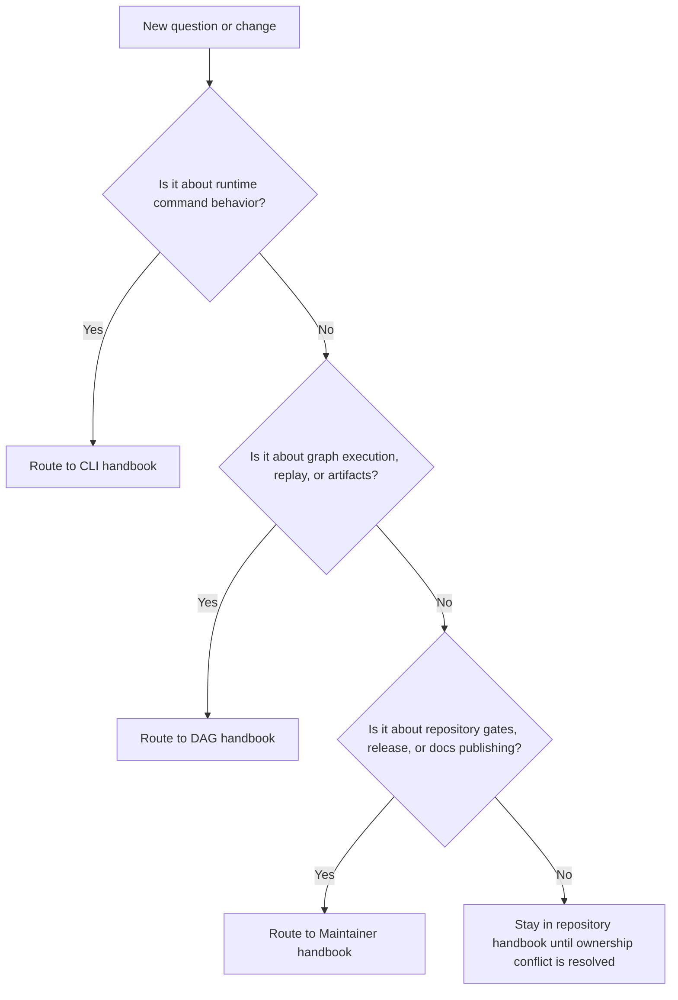

# Decision Rules

When a reader is unsure where to start, the repository should offer routing
rules instead of making them guess.

## Routing Rules

- if the question is about runtime command behavior, go to [CLI](../../bijux-cli/index.md)
- if the question is about graph execution, replay, or artifacts, go to
  [DAG](../../bijux-dag/index.md)
- if the question is about repository gates, docs publishing, or release
  control, go to [Maintainer](../../bijux-dev/index.md)
- if two branches both seem to own the answer, stay in the repository handbook
  until the ownership conflict is resolved

## Escalate To The Repository Handbook When

- the change affects more than one product handbook
- the question involves root files or shared automation
- the docs tree itself is inconsistent

## Next Reads

- [Package Map](package-map.md)
- [Repository Handbook](../index.md)
- [Maintainer Handbook](../../bijux-dev/index.md)
