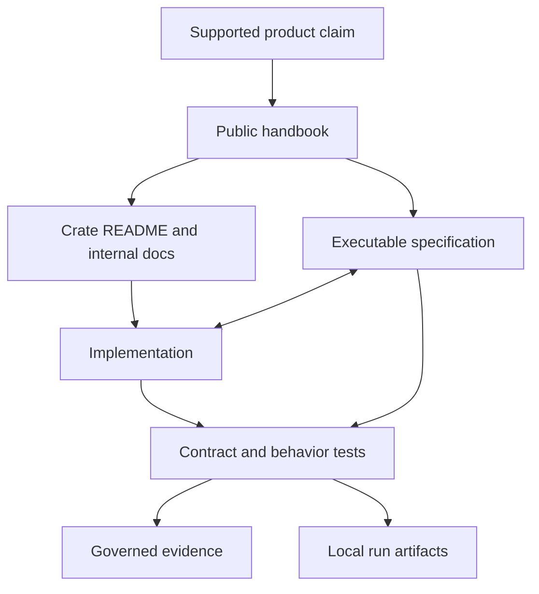

# Documentation System

This repository contains four different kinds of written material. They have
different readers and different authority. Keeping those roles explicit is
more important than maximizing page count.

## Public Handbooks

The pages under `docs/bijux-core`, `docs/bijux-cli`, `docs/bijux-dag`, and
`docs/bijux-dev` are the published website. They answer reader questions:

- what the products do and do not promise
- how to install, operate, diagnose, and verify them
- how packages divide responsibility
- how maintainers develop and release the repository

Each page must own a distinct question. A page that repeats another page,
exists only to satisfy a numeric quota, or provides headings without usable
content should be merged or removed.

## Executable Specifications

`docs/spec` contains prose contracts read by repository tooling and tests.
These files are versioned inputs to governance, not a browsing hierarchy.
Their exact language and paths can be executable interfaces. A handbook may
explain a contract and link to its repository source, but must not duplicate it
as a second authority. `docs/spec/README.md` defines the admission and editing
rules for that contract surface.

## Generated Evidence

`docs/reports` contains generated or mechanically governed evidence. Reports
show what a check observed at a particular repository state. They do not define
product behavior, and they are not published as user guidance. When a report
and its source contract disagree, the report is stale.
`docs/reports/README.md` defines report provenance, freshness, review, and
retention rules.

Local command output, logs, sites, and ad hoc analysis belong under
`artifacts/`, not in `docs/reports`.

## Planning Records

Planning material is not product truth. Current limitations belong beside the
affected product; future direction belongs in an explicitly non-binding
[DAG future direction](../../bijux-dag/foundation/future-direction.md). Status ledgers that enforce a
contract belong with the executable specification or generated evidence that
owns them.

## Repository And Crate Pages

The root `README.md` orients a new reader and provides the shortest verified
start. It does not reproduce the operator handbooks. Each crate `README.md`
states that crate's responsibility, public surface, dependencies, and
verification entrypoint. The crate-local contracts page records package ownership constraints,
while `CHANGELOG.md` records released changes.

Crate-local `docs/` directories are appropriate only for detail that is useful
to that crate's consumers and too specific for its README. They are not a
place to mirror the public website.

Each crate documentation directory is capped at ten Markdown pages. That cap is
a design constraint, not a target. A page is admitted only when it owns a
durable package question such as architecture, contracts, data evolution,
failure semantics, effect ownership, or verification. The crate README must
link every admitted page so internal guidance remains discoverable without
searching the tree.

## Change And Evidence Flow

Only reviewable, revision-relevant evidence enters `docs/reports`. Logs,
temporary sites, and local diagnostics terminate under `artifacts/`. This
separation keeps the documentation tree useful to readers and prevents a
successful local run from becoming an undocumented product claim.

## Ownership Matrix

| Surface | Primary reader | Owns | Must not own |
| --- | --- | --- | --- |
| root `README.md` | new users and contributors | product orientation and verified entrypoints | complete command or package reference |
| public handbooks | users, operators, contributors | supported workflows, limits, and package routing | private implementation details |
| crate README and `docs/` | crate consumers and maintainers | package boundary, internal contracts, and change guidance | repository-wide policy or duplicate user tutorials |
| `docs/spec/` | maintainers and contract tests | enforced behavioral intent | unevaluated proposals or run results |
| `docs/reports/` | reviewers and release maintainers | reproducible evidence at a source revision | normative behavior |
| `artifacts/` | local operators and automation | transient output and diagnostics | versioned authority |

## Authority Order

When two sources appear to disagree, use this order:

1. machine-readable schemas and contracts for serialized or release-governed
   behavior
2. executable specifications and tests for enforced repository behavior
3. public handbooks for supported reader-facing behavior
4. crate pages for package-local detail
5. generated reports for evidence about a particular revision

An inconsistency is a defect. The order identifies which source must be
examined first; it does not excuse leaving the other source stale.
