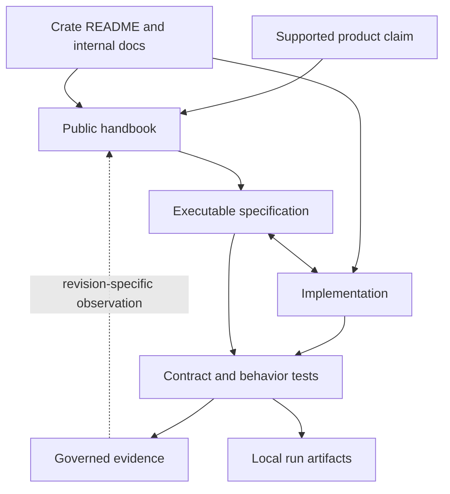

# Documentation And Evidence Authority

Bijux publishes supported behavior, enforces contracts, and records
revision-specific evidence in different surfaces. Their roles are deliberately
separate: guidance explains how to act, contracts define machine-governed
meaning, and evidence records what a particular execution observed.

## Authority Map

| Surface | Authority | Appropriate conclusion |
| --- | --- | --- |
| root `README.md` and public handbooks | supported product boundary, operator workflow, package routing, and explicit limits | what users and operators can rely on in the named release |
| machine-readable contracts and schemas | serialized shape, registry membership, package status, release lanes, and compatibility identifiers | whether an input or published surface conforms to a governed contract |
| executable specifications and tests | enforced invariants and selected behavior | whether the tested invariant passed at the identified source revision |
| crate README and package-local documentation | package responsibility, public imports, implementation contracts, and focused verification | which package owns a behavior and how its consumers integrate |
| governed reports | reproducible observation tied to a producer and source state | what the producer measured or inventoried for that revision |
| local `artifacts/` | logs, sites, test results, benchmarks, and diagnostics from one local execution | what that exact command observed; no broader product claim |
| release notes and changelogs | released differences and migration information | what changed on the named release line |
| future direction | non-binding promotion criteria and intended boundaries | no claim that the capability ships today |

Public handbooks live under `docs/bijux-core`, `docs/bijux-cli`,
`docs/bijux-dag`, and `docs/bijux-dev`. Executable prose contracts live under
`docs/spec`; governed observations live under `docs/reports`. Those internal
surfaces are repository authorities but are intentionally excluded from the
published navigation.

## Change And Evidence Flow

Reports may support a handbook claim, but they cannot create support by
themselves. A benchmark can establish a measured result for its workload; it
cannot promote an experimental backend. A successful local gate can establish
its selected result; it cannot replace release reconciliation.

## Resolve A Conflict

When sources disagree:

1. identify the exact behavior, release, package, and source revision;
2. use machine-readable contracts for serialized and release-governed meaning;
3. use executable specifications and tests for enforced behavior;
4. use the public handbook for the supported operator boundary;
5. use crate material to locate implementation ownership;
6. use reports and local artifacts only for the revision and selection they
   identify.

The narrower supported claim wins until the inconsistency is repaired.
Documentation that promises more than the executable contract is wrong;
passing code that silently exceeds or contradicts the public boundary is also
a compatibility defect.

## Evidence Acceptance

An artifact supports a decision only when it identifies its producer, source
revision, selected inputs, terminal status, and applicable integrity or
freshness control. Missing provenance narrows the conclusion to “a file
exists.” Stale evidence remains useful for history, but not for deciding the
current release.
