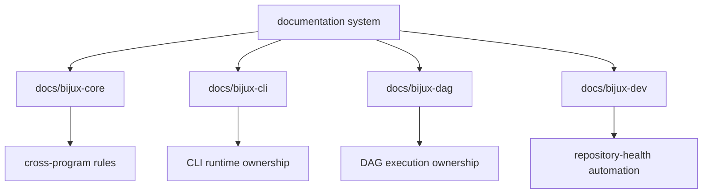

# Documentation System

The documentation system exists so repository behavior stays readable from
checked-in pages instead of being reconstructed from code and CI alone.

## Handbook Roots

- `docs/bijux-core/` for repository-level foundation, architecture, and operations
- `docs/bijux-cli/` for CLI ownership and package detail
- `docs/bijux-dag/` for DAG ownership and package detail
- `docs/bijux-dev/` for maintainer automation and repository-health work

## System Rules

- each handbook root should explain when to stay and when to leave
- navigation should follow durable ownership boundaries
- package tabs should point to concrete package docs, not abstract placeholders
- docs claims should link to code, contracts, tests, or workflows

## Code Anchors

- `mkdocs.yml`
- `mkdocs.shared.yml`
- `docs/overrides/partials/bijux-nav.html`
- `makes/docs.mk`

## Next Reads

- [Domain Language](domain-language.md)
- [Change Principles](change-principles.md)
- [Operations](../operations/index.md)
