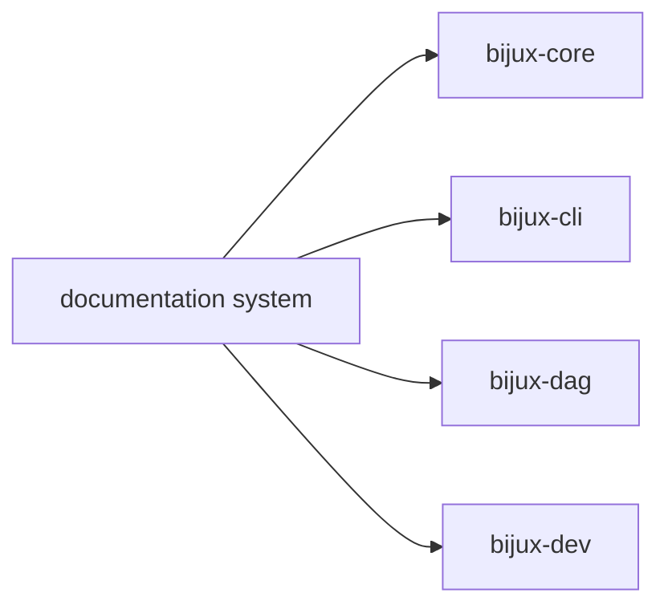

# Documentation System

This page explains how the repository keeps its behavior readable in checked-in
docs instead of scattering the story across code and CI.

The split matters because each handbook answers a different kind of question.
The documentation system works when a reader can tell where to go next without
reconstructing the repository from implementation details.

## Handbook Map

## Handbook Roots

- `docs/bijux-core/` for repository-level foundation, architecture, and operations
- `docs/bijux-cli/` for CLI ownership and package detail
- `docs/bijux-dag/` for DAG ownership and package detail
- `docs/bijux-dev/` for maintainer automation and repository-health work

## System Rules

- each handbook root should explain when to stay and when to leave
- navigation should follow durable ownership boundaries
- package tabs should point to concrete package docs, not abstract placeholders
- docs claims should link to code, contracts, tests, or workflows

## Reading Rule

Use this page when the repository shape is still unclear and the first need is
to understand how the handbooks divide responsibility.

## Code Anchors

- `mkdocs.yml`
- `mkdocs.shared.yml`
- `docs/overrides/partials/bijux-nav.html`
- `makes/docs.mk`

## Next Reads

- [Domain Language](domain-language.md)
- [Change Principles](change-principles.md)
- [Operations](../operations/index.md)
