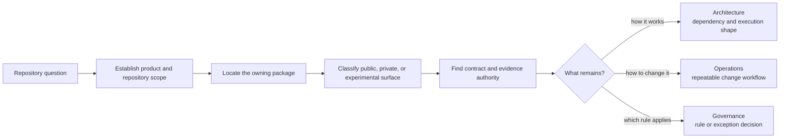

# Core Foundation

The foundation section explains what `bijux-core` publishes, what stays
private, how the repository is laid out, and which terms stay durable across
all four handbooks.

Foundation is the routing layer for repository questions. It does not replace
crate documentation or product handbooks; it establishes enough ownership and
scope to choose the correct authority without reading the entire workspace.

## Foundation Decisions

| Decision | Primary authority | Result |
| --- | --- | --- |
| which product owns the behavior? | [Platform Overview](platform-overview.md) | CLI, DAG, or repository-maintainer boundary |
| which crate should change? | [Package Map](package-map.md) | one semantic owner and its downstream consumers |
| can downstream users depend on it? | [Package Boundary](package-boundary.md) and [Module Surface Lanes](module-surface-lanes.md) | published, private, stable, experimental, or simulated classification |
| where does the source live? | [Workspace Layout](workspace-layout.md) | repository path and adjacent authorities |
| which terms and names are canonical? | [Domain Language](domain-language.md) | durable vocabulary for code and docs |
| what proves a claim? | [Documentation System](documentation-system.md) | handbook, specification, test, and evidence relationship |

## What This Section Covers

- [Platform Overview](platform-overview.md)
- [Repository Scope](repository-scope.md)
- [Workspace Layout](workspace-layout.md)
- [Package Map](package-map.md)
- [Package Boundary](package-boundary.md)
- [Current Implemented Capabilities](current-implemented-capabilities.md)
- [Documentation System](documentation-system.md)
- [Module Surface Lanes](module-surface-lanes.md)
- [Ownership Model](ownership-model.md)
- [Domain Language](domain-language.md)
- [Change Principles](change-principles.md)
- [Decision Rules](decision-rules.md)

## Reading Rule

Use Foundation first when the question is still about scope, package
publication, layout, and ownership. Move to Architecture or Operations once
the repository split is already clear.

Do not infer support from source visibility alone. A public Rust item may be
experimental, a repository command may be maintainer-only, and a modeled DAG
surface may intentionally remain outside the shipped operator boundary. The
narrower package, release, and compatibility authorities decide.
