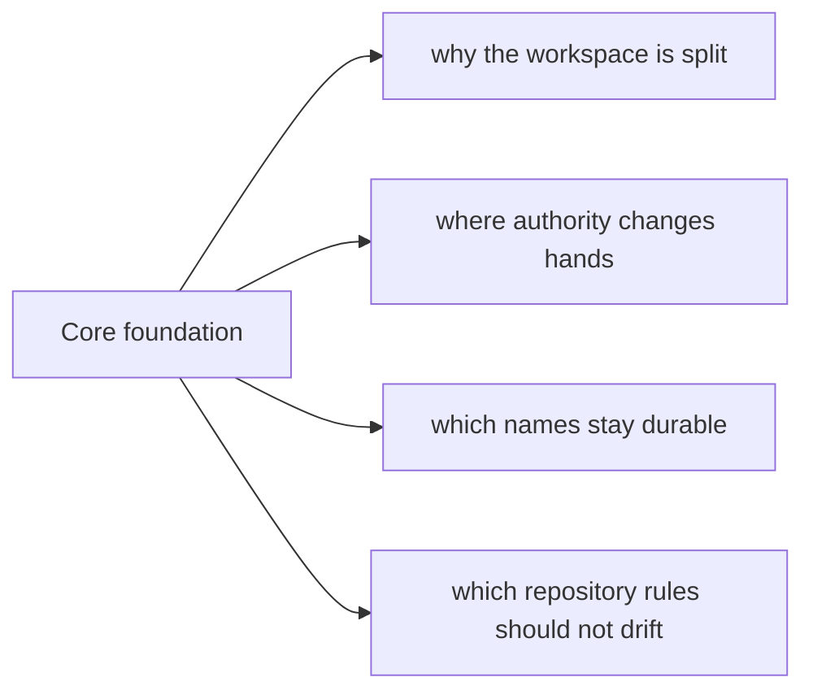

# Core Foundation

The foundation section explains what `bijux-core` publishes, what stays
private, how the repository is laid out, and which terms stay durable across
all four handbooks.

## What This Section Covers

- [Platform Overview](platform-overview.md)
- [Repository Scope](repository-scope.md)
- [Workspace Layout](workspace-layout.md)
- [Package Map](package-map.md)
- [Package Boundary](package-boundary.md)
- [Current Implemented Capabilities](current-implemented-capabilities.md)
- [Documentation System](documentation-system.md)
- [Module Surface Lanes](module-surface-lanes.md)
- [Ownership Model](ownership-model.md)
- [Domain Language](domain-language.md)
- [Change Principles](change-principles.md)
- [Decision Rules](decision-rules.md)
- [Root Policy Surface Report](root-policy-surface-report.md)
- [Backlog Routing Ledger](backlog-routing-ledger.md)

## Reading Rule

Use Foundation first when the question is still about scope, package
publication, layout, and ownership. Move to Architecture or Operations once
the repository split is already clear.
