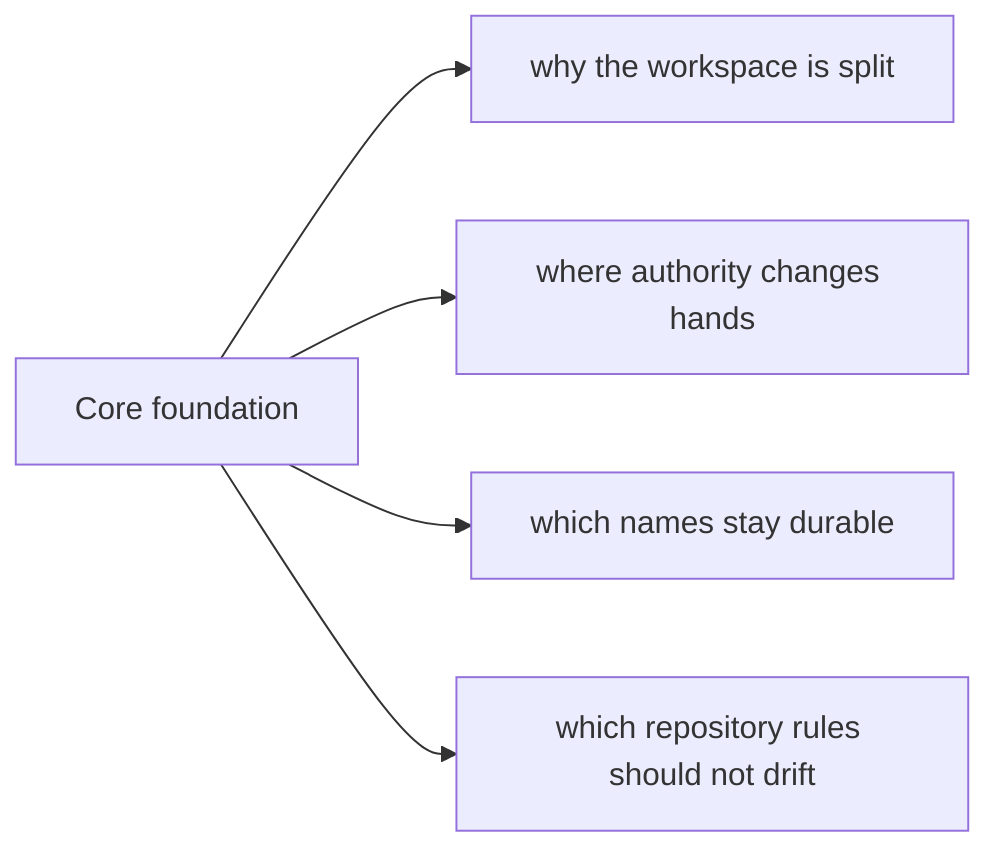

# Core Foundation

The foundation section explains why `bijux-core` exists in this shape before it
explains how the workspace is operated. Start here when you need the split,
the vocabulary, and the ownership model to make sense before you read deeper
architecture or operations pages.

## Pages In This Section

- [Platform Overview](platform-overview.md)
- [Repository Scope](repository-scope.md)
- [Workspace Layout](workspace-layout.md)
- [Package Map](package-map.md)
- [Package Boundary](package-boundary.md)
- [Ownership Model](ownership-model.md)
- [Domain Language](domain-language.md)
- [Documentation System](documentation-system.md)
- [Change Principles](change-principles.md)
- [Decision Rules](decision-rules.md)

## Reading Rule

Use Foundation first when the question is still about shape and ownership. Move
to Architecture or Operations once the repository split is already clear.
