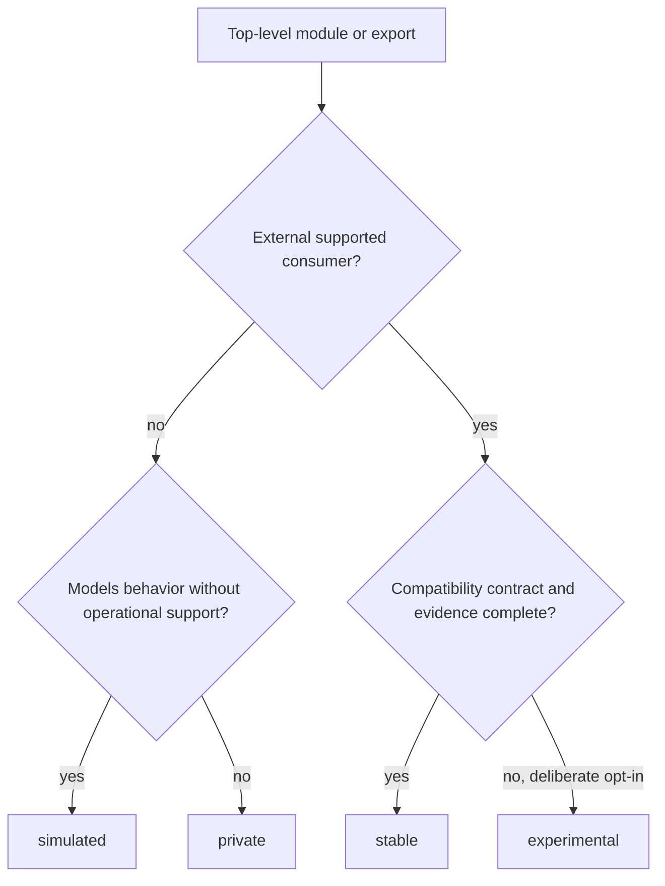

# Module Surface Lanes

`bijux-core` classifies crate module exports by surface lane so public modules
and internal modules do not drift into ambiguous ownership.

The governing contract for this page is
`contracts/foundation/module_surface_lanes.v1.json`.

## Lane Meanings

| Lane | Visibility | Compatibility | Release claim |
| --- | --- | --- | --- |
| stable | public | durable downstream use | may support the package's published stable surface |
| experimental | public by deliberate opt-in | change is permitted within the documented experimental policy | does not widen the stable package promise |
| simulated | public or feature-gated for modeling | evidence and shape are testable, operational readiness is not promised | cannot support a production-readiness claim |
| private | crate-internal | no downstream compatibility promise | excluded from public release claims |

Visibility and support are separate. `pub` is a Rust reachability decision;
the lane contract determines the compatibility and release meaning.

## Lane Decision

Experimental is not a waiting room that every new public module must enter.
Keep a module private until a real external consumer and coherent public
contract exist.

## Promotion Evidence

Moving a module into `stable` requires:

- an owned downstream use case that cannot be served by an existing facade;
- intentional exports with rustdoc and package documentation;
- compatibility-sensitive tests for data shape, errors, and behavior;
- feature and dependency impact review;
- release-note and versioning treatment;
- removal of contradictory experimental or simulated claims.

Moving a module out of `stable` is a compatibility event. Hiding the export or
renaming the lane does not avoid migration and versioning obligations.

## Reading Rules

- Treat `private` as the default lane unless a module is explicitly listed in
  the contract's public surface entries.
- Keep `stable`, `experimental`, and `simulated` exports disjoint.
- When a top-level `pub mod` changes, update the contract and the related
  contract tests in the same change set.
- Do not use module names or lane descriptions that depend on temporary
  delivery order or roadmap shorthand.

## Cross-Crate Interpretation

Lane names are package-local contracts under one repository policy. A stable
type in `bijux-dag-core` does not make a runtime backend stable, and a
simulated runtime model does not become operational because an application or
maintainer crate can import it. Each package boundary and the product release
boundary must agree before a cross-crate capability is presented as supported.

## Verification

- `contracts/foundation/module_surface_lanes.v1.json`
- `crates/bijux-dev/tests/foundation_module_surface_contracts.rs`
- the library entrypoint owned by each workspace crate

## Next Reads

- [Documentation System](documentation-system.md)
- [Package Boundary](package-boundary.md)
- [Domain Language](domain-language.md)
