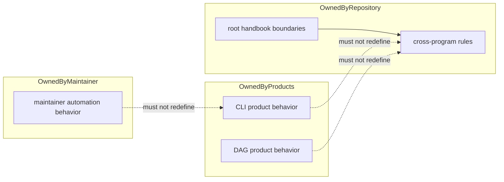

# Ownership Model

Ownership in `bijux-core` is explicit on purpose. The repository is healthiest
when every behavior claim names one owner and every root rule explains why it
is above package scope.

## What Ownership Means Here

In this repository, ownership is not just about who wrote the code. It means:

- which handbook explains the behavior
- which crate or root surface is authoritative
- which tests or contracts prove the behavior
- which release or compatibility surface must move when it changes

Without that clarity, `bijux-core` becomes harder to review than it should be
because readers have to reconstruct the intended owner from scattered clues.

## Ownership Rules

- product behavior belongs to CLI or DAG package handbooks
- repository-health automation belongs to `bijux-dev`
- root docs describe cross-program rules and boundaries, not package internals
- cross-package changes must update every affected handbook branch

## Where Authority Changes Hands

### Product handbooks

`docs/bijux-cli/` and `docs/bijux-dag/` own the public behavior stories for the
two shipped product families. They should explain command behavior, user
workflows, and product-facing guarantees directly.

### Maintainer handbook

`docs/bijux-dev/` owns repository proof, release, diagnostics, and maintainer
automation. It should not quietly redefine public product meaning.

### Repository handbook

`docs/bijux-core/` owns the shared layer between them: workspace shape, package
boundaries, release rules, shared contracts, and other cross-product questions.

## Boundary Violations

- root pages describing package-local behavior in detail
- maintainer docs redefining end-user command semantics
- package docs making repository-wide policy claims without root anchors

## What Healthy Ownership Looks Like

A reader should be able to answer all of these without guesswork:

- where do I read the supported behavior?
- which crate or root surface implements it?
- where is the proof if that behavior changes?
- which other surfaces must update with it?

## Next Reads

- [Package Map](package-map.md)
- [Decision Rules](decision-rules.md)
- [Package Ownership](../governance/package-ownership.md)
