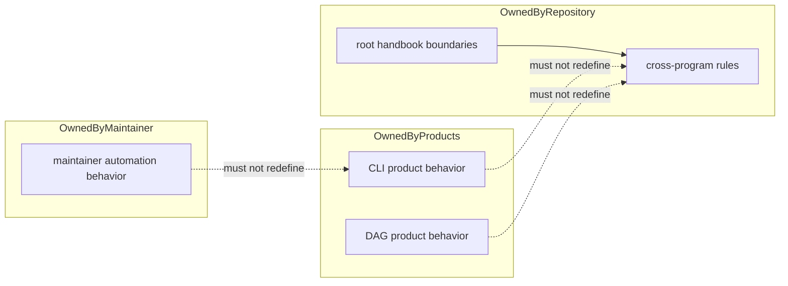

# Ownership Model

Ownership in `bijux-core` is explicit on purpose. The repository is healthiest
when every behavior claim names one owner and every root rule explains why it
is above package scope.

## Ownership Rules

- product behavior belongs to CLI or DAG package handbooks
- repository-health automation belongs to `bijux-dev`
- root docs describe cross-program rules and boundaries, not package internals
- cross-package changes must update every affected handbook branch

## Boundary Violations

- root pages describing package-local behavior in detail
- maintainer docs redefining end-user command semantics
- package docs making repository-wide policy claims without root anchors

## Next Reads

- [Package Map](package-map.md)
- [Decision Rules](decision-rules.md)
- [Package Ownership](../governance/package-ownership.md)
