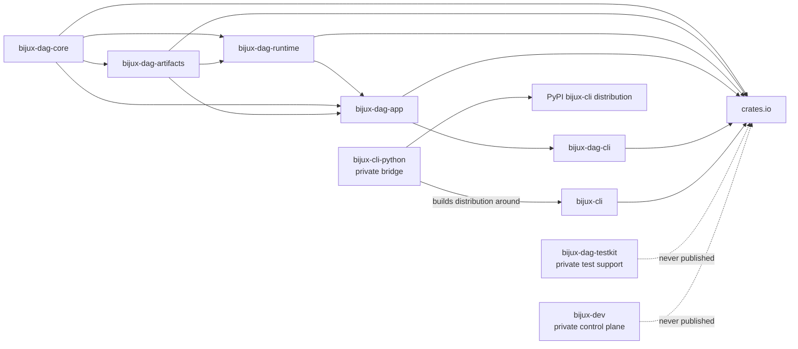

# Package Boundary

`bijux-core` ships two public release families and several repository-internal
support crates. The publication boundary below is the durable answer for which
workspace packages are public releases and which remain private support code.

The contract source for this page is
`contracts/foundation/workspace_package_boundary.v1.json`.

## Publication Graph

The horizontal DAG chain shows governed publication sequence, not Cargo
dependency for every adjacent pair. The arrows into crates.io show registry
publication. The private Python bridge participates in building the public
PyPI distribution without becoming a public Rust crate.

## Release Status Table

| Package | Product family | Release status | Purpose |
| --- | --- | --- | --- |
| `bijux-cli` | `bijux-cli` | public | operator-facing command runtime for automation, plugin routing, interactive workflows, and structured output |
| `bijux-cli-python` | `bijux-cli` | private | Python packaging bridge for the `bijux` command runtime |
| `bijux-dag-core` | `bijux-dag` | public | deterministic DAG kernel for graph parsing, validation, canonicalization, planning, and identity |
| `bijux-dag-artifacts` | `bijux-dag` | public | artifact identity, persistence, and integrity primitives for DAG run evidence |
| `bijux-dag-runtime` | `bijux-dag` | public | execution kernel, scheduler policy, replay decisions, and runtime state transitions for DAG runs |
| `bijux-dag-app` | `bijux-dag` | public | DAG command orchestration, inspection, replay, and verification response shaping |
| `bijux-dag-cli` | `bijux-dag` | public | thin `bijux-dag` executable wrapper over the DAG application surface |
| `bijux-dag-testkit` | `bijux-dag` | private | shared deterministic fixtures, fake adapters, and DAG assertions for repository tests |
| `bijux-dev` | `maintainer` | private | maintainer control plane for release governance, repository evidence, and diagnostics |

## Interpret Release Status

- `public` means the crate is part of the supported crates.io release boundary.
- `private` means the crate remains repository-owned support code with
  `publish = false`.
- public crates must not depend on private crates.
- private does not mean unused or low-trust; it means consumers do not receive
  that crate as an independent registry contract.

## Distribution Boundary

| Release result | Source packages | Consumer contract |
| --- | --- | --- |
| crates.io CLI | `bijux-cli` | Rust library and `bijux` binary behavior |
| PyPI CLI | `bijux-cli-python` plus `bijux-cli` | Python-installed `bijux` entrypoint with the same root command semantics |
| crates.io DAG | five public `bijux-dag-*` crates | reusable graph, artifact, runtime, application, and binary layers |
| GitHub and GHCR bundles | CLI and DAG build families | stamped installable archives, metadata, and immutable checksums or digests |
| maintainer control plane | `bijux-dev` | repository-local execution only; no end-user registry promise |

## crates.io Publication Order

The canonical crates.io publish order is:

1. `bijux-dag-core`
2. `bijux-dag-artifacts`
3. `bijux-dag-runtime`
4. `bijux-dag-app`
5. `bijux-dag-cli`
6. `bijux-cli`

Publication waits for each dependency to become available before publishing
its consumer. `bijux-cli` is last in the governed sequence but remains
architecturally independent of the DAG crates.

## Boundary Changes

A publication change must update and reconcile:

1. the machine contract and Cargo `publish` metadata;
2. public dependency closure and topological order;
3. generated release configuration and registry allowlists;
4. package contents, dry-run publication, and installed smoke proof;
5. documentation, migration, ownership, and support commitments;
6. every registry and bundle inventory affected by the new boundary.

Making a private crate public is an API and support decision, not a workflow
toggle. Making a public crate private requires a consumer migration and cannot
erase already published versions.

## Enforcement And Evidence

- `crates/bijux-dev/tests/release_validation_suite_contracts.rs` checks release
  inventory and validation behavior.
- `makes/rust.mk` prepares a committed release tree, packages public DAG
  crates, and dry-runs publication in order.
- `.github/release.env` carries the generated hosted package allowlist.
- Post-publication reconciliation compares registry identities with the tag
  and expected inventory.

## Publication References

- [Package Map](package-map.md)
- [Repository Packages](../packages/index.md)
- [Release Operations](../../bijux-dev/operations/release-operations.md)
- [Release Validation Suite](../../bijux-dev/operations/release-validation-suite.md)
