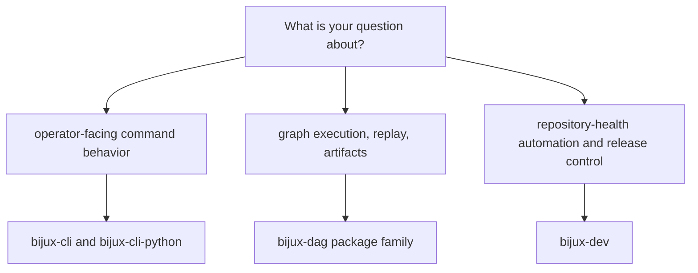

# Package Map

The package map exists so readers can route from a repository question to the
owning package family before they inspect source files.

## Package Families

| Package family | Owns | Open next |
| --- | --- | --- |
| `bijux-cli` and `bijux-cli-python` | operator-facing command behavior and Python distribution | [CLI Handbook](../../bijux-cli/index.md) |
| `bijux-dag-core`, `runtime`, `app`, `cli`, `artifacts`, `testkit` | graph truth, execution, artifacts, replay, and DAG command orchestration | [DAG Handbook](../../bijux-dag/index.md) |
| `bijux-dev` | repository-health automation, evidence, and release control | [Maintainer Handbook](../../bijux-dev/index.md) |

## Reading Rule

Use the repository handbook only long enough to choose the correct branch. Once
the owner is clear, move to the owning handbook and package page.

## Next Reads

- [Ownership Model](ownership-model.md)
- [Repository Packages](../packages/index.md)
- [Decision Rules](decision-rules.md)
