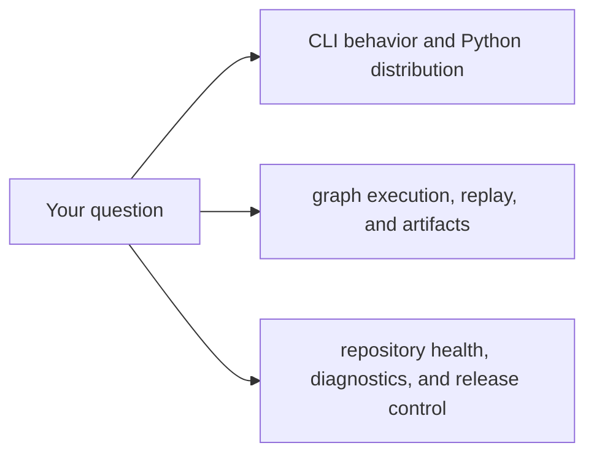

# Package Map

Use the package map when you know the behavior you care about, but you do not
yet know which package or handbook owns it.

For canonical public/private publication status, use
[Package Boundary](package-boundary.md).

## Fast Ownership Guide

| If the question is about... | Owning package family | Open next |
| --- | --- | --- |
| `bijux` command behavior, config, REPL, plugin routing, or Python distribution | `bijux-cli` and `bijux-cli-python` | [CLI Handbook](../../bijux-cli/index.md) |
| graph semantics, DAG execution, replay, retained artifacts, or `bijux-dag` command behavior | `bijux-dag-core`, `bijux-dag-runtime`, `bijux-dag-app`, `bijux-dag-cli`, `bijux-dag-artifacts`, `bijux-dag-testkit` | [DAG Handbook](../../bijux-dag/index.md) |
| repository diagnostics, evidence reports, release proof, docs automation, or repository gates | `bijux-dev` | [Maintainer Handbook](../../bijux-dev/index.md) |

## Reading Rule

Stay on this page only long enough to choose the owner. After that:

- go to the owning handbook for the product or maintainer story
- go to the package page when you need the exact crate boundary
- come back here only when the answer crosses families

## Typical Misroutes

- `bijux dag ...` mounted through the root runtime still becomes a DAG-handbook
  question once the issue is graph execution rather than root CLI routing
- Python packaging questions belong to the CLI family even when they launch the
  same runtime as the Rust binary
- release, docs, and gate failures belong to the maintainer family even when
  they mention CLI or DAG package names

## Next Reads

- [Ownership Model](ownership-model.md)
- [Package Boundary](package-boundary.md)
- [Repository Packages](../packages/index.md)
