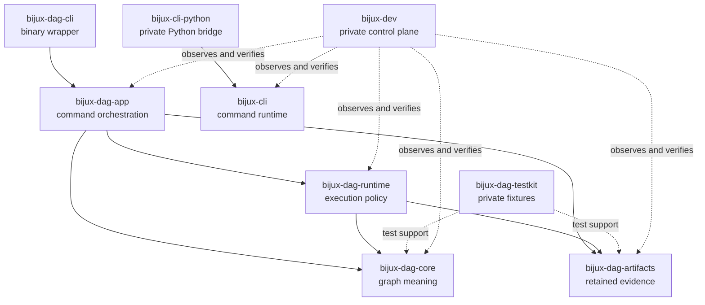

# Package Map

Package ownership follows semantic direction: deterministic models sit below
execution, execution sits below orchestration, and public command wrappers sit
at the outer edge. Test and maintainer support can depend inward; public
products never depend on repository governance.

For the authoritative public-versus-private release answer, use
[Package Boundary](package-boundary.md).

## Package Topology

The CLI and DAG product families do not share runtime implementation through a
Cargo edge. Mounted-product integration occurs at the command and process
boundary.

## Route By Behavior

| If you need to understand... | Owning package family | Why that family owns it | Read next |
| --- | --- | --- | --- |
| `bijux` commands, mounted apps, plugin routing, layered config, REPL behavior, history, memory, or Python delivery | `bijux-cli` and `bijux-cli-python` | this family owns the operator-facing runtime and the Python packaging lane that delivers it | [CLI Handbook](../../bijux-cli/index.md) |
| graph parsing, validation, planning, execution, artifacts, replay, verification, or `bijux-dag` commands | `bijux-dag-core`, `bijux-dag-runtime`, `bijux-dag-app`, `bijux-dag-cli`, `bijux-dag-artifacts`, and `bijux-dag-testkit` | this family owns the DAG model, runtime policy, orchestration layer, executable wrapper, and retained evidence model | [DAG Handbook](../../bijux-dag/index.md) |
| release proof, repository diagnostics, docs automation, root gates, or evidence reporting | `bijux-dev` | this crate family owns repository control-plane behavior rather than end-user product behavior | [Maintainer Handbook](../../bijux-dev/index.md) |
| publication boundaries, shared contracts, or cross-product repository rules | repository root plus the owning crate family | these questions cross more than one product lane and usually need both docs and code context | [Repository Handbook](../index.md) |

## Package Responsibilities

| Package | Owns | Must not absorb |
| --- | --- | --- |
| `bijux-cli` | root parsing, routing, built-ins, plugins, apps, state, output, and Rust SDK | DAG graph or run semantics |
| `bijux-cli-python` | Python packaging and native bridge to the same runtime | a second Python implementation of command behavior |
| `bijux-dag-core` | parsing, validation, canonicalization, graph identity, and planning meaning | filesystem, process, environment, clock, or scheduler behavior |
| `bijux-dag-artifacts` | run paths, manifests, indexes, hashes, lineage, retention, and integrity | execution scheduling or command presentation |
| `bijux-dag-runtime` | engine state, scheduling, attempts, adapters, cache and replay decisions | CLI parsing or application response shaping |
| `bijux-dag-app` | use-case orchestration, inspection, replay, verification, and response schemas | binary startup or lower-layer implementation ownership |
| `bijux-dag-cli` | executable startup and delegation into the application | domain logic |
| `bijux-dag-testkit` | reusable deterministic fixtures, fake adapters, and assertions | production dependency or public release promise |
| `bijux-dev` | repository suites, diagnostics, evidence, governance, and release proof | product semantics |

## Common Routing Mistakes

| When the question sounds like... | The real owner is usually... | Why |
| --- | --- | --- |
| "The `bijux` runtime can mount DAG commands, so this must be a CLI-only issue." | the DAG family once the question becomes graph execution, replay, or evidence | the CLI surface can launch DAG behavior without owning DAG semantics |
| "Python packaging is separate from the runtime." | the CLI family | the delivery format changes, but the public runtime story stays the same |
| "The release job is failing, so I should inspect product docs first." | the maintainer family | release proof, standards sync, and repository gates live above any one product handbook |
| "This schema lives under `contracts/`, so it is a root-only concern." | the root plus the crate that enforces it | shared contracts still need a concrete product or maintainer owner |

## Resolve Ambiguous Ownership

Use these questions when the route is still unclear:

1. Is the reader trying to run a product, author a DAG, or maintain the repo?
2. Does the behavior end at one executable, or does it cross products?
3. If a test failed, which crate or maintainer suite would be expected to
   catch that drift first?

If those answers still span more than one family, stay in the repository
handbook and then drill down from there.

If two packages appear to own the same fact, identify the narrowest semantic
authority and expose a contract from it. Do not introduce a reverse dependency
or duplicate an implementation to avoid a clean boundary. The dependency
allowlists and architecture tests reject several common reverse edges, but
review still owns whether a new permitted edge is conceptually correct.

## Package Boundary References

- [Ownership Model](ownership-model.md)
- [Package Boundary](package-boundary.md)
- [Dependency Direction](../architecture/dependency-direction.md)
- [Repository Packages](../packages/index.md)
