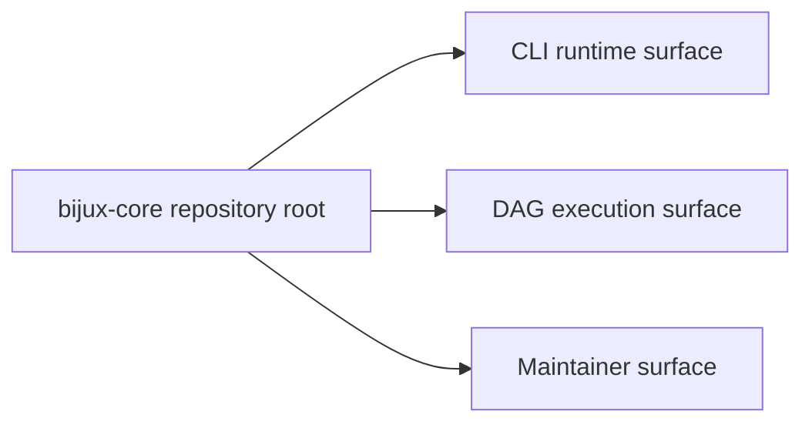

# Platform Overview

`bijux-core` is one workspace with more than one public surface. It keeps CLI
runtime behavior, DAG execution behavior, and repository-health automation in
one governed repository without pretending they are one package.

## What The Repository Organizes

- `bijux-cli` owns the operator-facing command runtime and the Python bridge
- `bijux-dag-*` owns graph truth, execution, replay, and artifact semantics
- `bijux-dev` owns repository-health automation, evidence, and release control
- the repository root owns cross-program rules, shared docs, contracts, and
  automation entrypoints

## Stable Reader-Facing Claims

- `bijux` is a public command runtime.
- `bijux-dag` is a public local-first DAG product.
- `bijux-cli-python`, `bijux-dag-testkit`, and `bijux-dev` are repository
  support crates, not end-user product surfaces.
- Simulated DAG namespaces and maintainer-only routes may exist in the code and
  docs, but they are not public `v0.4.0` product promises.

## Why The Split Exists

- command runtime behavior and DAG behavior have different public contracts
- release and documentation evidence must stay reviewable above both products
- maintainer automation should stay explicit instead of leaking into product
  packages

## Reading Rule

Use this page to understand the top-level split. Move to Package Map when you
need the owning package family, Package Boundary when you need public versus
private publication status, and Architecture when the question is about crate
boundaries or dependency direction.

## Next Reads

- [Repository Scope](repository-scope.md)
- [Package Map](package-map.md)
- [Package Boundary](package-boundary.md)
- [Core Architecture](../architecture/index.md)
