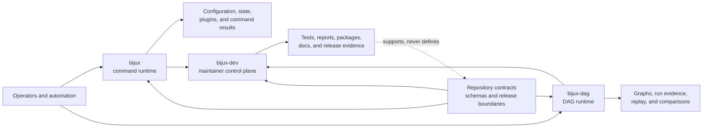
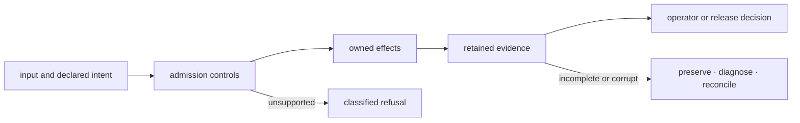

# Platform Overview

`bijux-core` is the source, contract, evidence, and release home for two public
products:

- `bijux` is a command runtime for automation, mounted applications, trusted
  plugins, configuration, diagnostics, state, and interactive use.
- `bijux-dag` is a local-first execution system for validating graphs, planning
  work, running supported backends, retaining evidence, replaying decisions,
  and comparing outcomes.

The private `bijux-dev` control plane observes and proves those products. It is
substantial repository infrastructure, but it is not an alternate public
runtime.

## Platform Shape

The solid edges show consumption and observation. The dotted edge is a trust
limit: generated proof can validate or challenge a contract, but cannot
silently redefine one.

## Choose The Right Surface

| Outcome | Public entrypoint | Durable result | Handbook |
| --- | --- | --- | --- |
| inspect or operate the command runtime | `bijux` | structured envelope, human output, state, or diagnostic result | [CLI](../../bijux-cli/index.md) |
| validate, plan, or execute a graph | `bijux-dag` | plan or retained run directory with inspectable evidence | [DAG](../../bijux-dag/index.md) |
| discover repository health | `bijux-dev-cli` | revision-bound observation or report | [Maintainer](../../bijux-dev/index.md) |
| execute governed repository suites | `bijux-dev-dag` | component records and aggregate gate status | [Maintainer](../../bijux-dev/index.md) |
| understand shared ownership or publication | repository contracts | package, compatibility, or release decision | [Repository](../index.md) |

Mounted applications create a routing integration between `bijux` and another
product. They do not transfer product semantics into the root CLI. For
example, `bijux` may route to an installed DAG executable, while graph and run
meaning remain owned by `bijux-dag`.

## Shared Repository, Separate Authority

The products live together because their release and trust boundaries meet:

- shared output, plugin, package, and release contracts need one reviewable
  authority;
- the Python distribution must deliver the same `bijux` behavior as the Rust
  runtime;
- the DAG package family must publish in dependency order while retaining one
  command and evidence story;
- documentation and release proof must describe the installable products, not
  only the source checkout;
- maintainer automation needs access to both product contracts without either
  product depending on maintainer code.

Co-location does not imply one compatibility surface. A CLI configuration
change, DAG run-schema change, and maintainer report-schema change have
different owners and consumers even when one release contains all three.

## Operating Surfaces

The workspace owns a chain of operational controls around both products:

| Surface | Control | Retained or inspectable result |
| --- | --- | --- |
| command admission | typed parsing, canonical routes, configuration validation, plugin lifecycle checks | structured envelope, classified diagnostic, and exit status |
| graph admission | schema, graph, selector, policy, capability, resource, and output-path validation | canonical graph, plan, diagnostics, and identities |
| execution | bounded concurrency, resources, retry, timeout, cancellation, and backend lifecycle | node attempts, scheduler events, terminal state, and streams |
| evidence | rooted storage, declared outputs, hashes, indexes, lineage, and completion markers | self-describing run directory |
| repository governance | named suites, source identity, generated references, and aggregate status | reports and gate evidence under `artifacts/` or governed paths |
| publication | package order, registry-specific plans, immutable identities, and non-cancelling release jobs | package versions, image digests, release assets, and deployed revision |

The sequence is intentionally fail-closed at admission and evidence
acceptance. It cannot prevent every external side effect: plugin code, shell
nodes, container engines, schedulers, registries, and deployment platforms
retain authority outside the process. Their prerequisites and limitations are
part of the corresponding product or maintainer contract.

## Trust Boundaries

| Boundary | What is guaranteed | What is deliberately not implied |
| --- | --- | --- |
| built-in `bijux` route | native command, envelope, stream, and exit semantics | safety of external plugin code |
| plugin or mounted app | validated namespace and integration contract | sandboxing or ownership of delegated behavior |
| `bijux-dag` stable lane | documented graph, execution, backend, and evidence contract | every simulated or internal repository capability |
| maintainer result | observation for the recorded revision and selection | a new public product promise |
| public package | supported registry publication boundary | that every workspace crate is public |

The current package and command release boundaries are machine-readable under
`contracts/foundation/`. When prose, generated reports, and those contracts
disagree, treat the release claim as unresolved.

## Read By Question

- [Repository Scope](repository-scope.md) — which questions belong above one
  product.
- [Package Map](package-map.md) — which package owns a behavior.
- [Package Boundary](package-boundary.md) — which crates publish and in what
  order.
- [System Overview](../architecture/system-overview.md) — how the code and
  contract layers depend on one another.
- [Repository Trust Evidence](../governance/trust-evidence.md) — how a release
  claim becomes inspectable.

## Authority Anchors

- `contracts/foundation/workspace_product_map.v1.json`
- `contracts/foundation/workspace_package_boundary.v1.json`
- `contracts/foundation/dag_release_truth_table.v1.json`
- `Cargo.toml`
