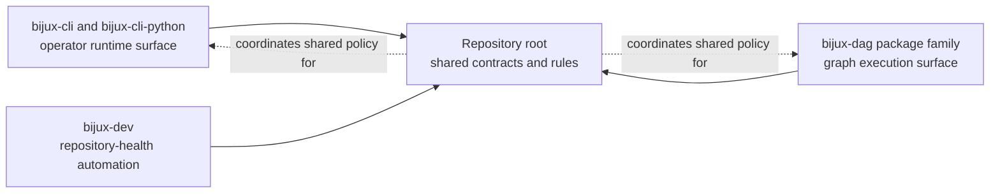

# Platform Overview

`bijux-core` is one workspace that publishes and governs more than one
behavioral surface. The repository exists so CLI runtime behavior, DAG
execution behavior, and repository-health automation can evolve together
without pretending they are one package.

## What The Repository Is Organizing

- `bijux-cli` owns the operator-facing command runtime and the Python bridge
- `bijux-dag-*` owns graph truth, execution, replay, and artifact semantics
- `bijux-dev` owns repository-health automation, evidence, and release control
- the repository root owns cross-program rules, shared docs, contracts, and
  automation entrypoints

## Why The Split Exists

- command runtime behavior and DAG behavior have different public contracts
- release and documentation evidence must stay reviewable above both products
- maintainer automation should stay explicit instead of leaking into product
  packages

## Next Reads

- [Repository Scope](repository-scope.md)
- [Package Map](package-map.md)
- [Core Architecture](../architecture/index.md)
