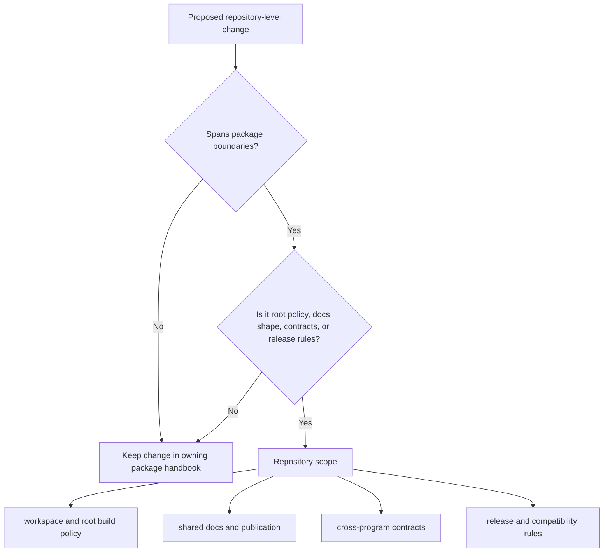

# Repository Scope

The repository root owns the things that cross package boundaries. It does not
own command semantics that already belong to the CLI handbook or execution
semantics that already belong to the DAG handbook.

## In Scope

- workspace membership and root build policy
- shared documentation structure and publication
- cross-program contracts under `contracts/`
- release, compatibility, and review rules that span more than one handbook

## Out Of Scope

- CLI runtime semantics that belong in `docs/bijux-cli/`
- DAG execution semantics that belong in `docs/bijux-dag/`
- maintainer implementation detail that belongs in `docs/bijux-dev/`

## Code Anchors

- `Cargo.toml`
- `Makefile`
- `contracts/`
- `mkdocs.yml`

## Next Reads

- [Workspace Layout](workspace-layout.md)
- [Decision Rules](decision-rules.md)
- [Repository Handbook](../index.md)
