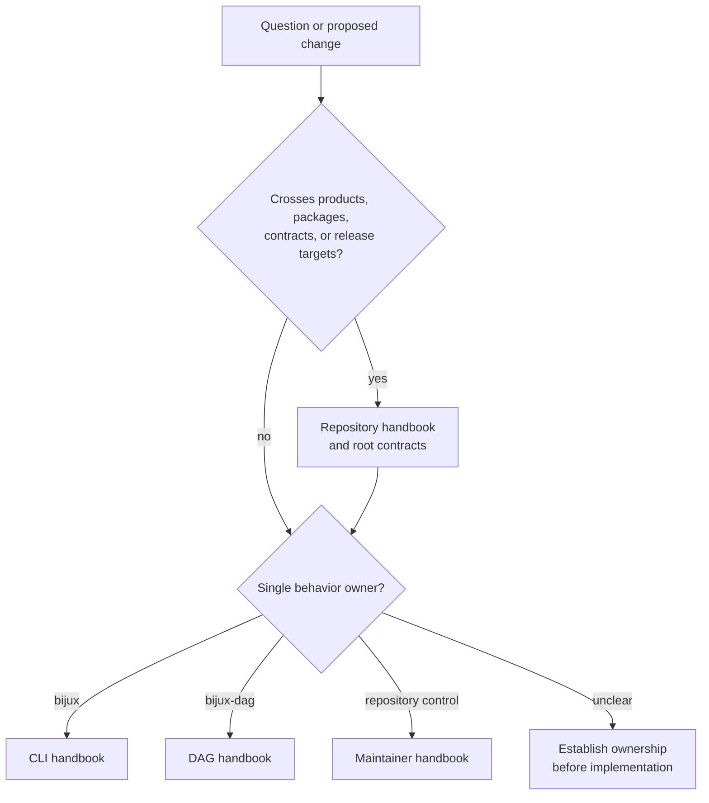

# Repository Scope

Repository authority begins where a question crosses product, package,
contract, documentation, or release boundaries. It ends as soon as one
product or maintainer surface can answer the question completely.

## Route A Question

Repository documentation establishes the cross-cutting decision, then routes
behavioral detail back to its owner. It must not become a duplicate command
manual or a second definition of DAG semantics.

## Use The Repository Handbook When The Question Crosses Boundaries

| Question type | Why it belongs here |
| --- | --- |
| Which product family or crate owns this surface? | ownership routing crosses package and handbook boundaries |
| Which crates are public and which stay repository-internal? | publication intent is a root release concern |
| Which shared contracts constrain more than one product family? | contracts under `contracts/` often feed both docs and tests across the workspace |
| Which review, release, or compatibility rules apply to both `bijux` and `bijux-dag`? | those rules must stay consistent above product-level docs |
| How is the workspace laid out and why does that shape matter? | root structure affects contributors across the whole repository |

## Leave The Repository Handbook When One Owner Is Clear

Once the answer clearly belongs to one product or one maintainer surface, move
to the owning handbook:

- [CLI Handbook](../../bijux-cli/index.md) for `bijux` runtime behavior
- [DAG Handbook](../../bijux-dag/index.md) for graph, run, replay, and
  artifact behavior
- [Maintainer Handbook](../../bijux-dev/index.md) for repository automation,
  release proof, and governance tooling

## Repository Authorities

| Root surface | Authority | Consumer-visible consequence |
| --- | --- | --- |
| `Cargo.toml` and workspace manifests | membership, shared versions, profiles, and dependency resolution | which packages build and release together |
| `contracts/` | machine-readable product, package, schema, lane, and release boundaries | what automation and documentation may claim |
| `Makefile` and `makes/` | reproducible repository entrypoints and artifact routing | how local and CI validation reach the same owner |
| `mkdocs.yml` and reader handbooks | public information architecture and published product guidance | which pages users can rely on |
| `.github/release.env` and release workflows | generated hosted publication plan and credentials boundary | which validated artifacts reach each registry |
| `docs/spec/`, `evidence/`, and `docs/reports/` | executable contracts, governed inputs, and maintained observations | how repository claims are tested and reviewed |

The last row contains different trust classes. A specification or governed
input may be authoritative; a generated report remains evidence for its
recorded producer and revision.

## What Usually Falls Out Of Scope

These belong elsewhere unless the root boundary itself is the subject:

- command syntax and runtime behavior for `bijux`
- DAG authoring or execution semantics
- implementation detail for `bijux-dev` maintainer commands
- crate-local behavior that does not affect release, docs, contracts, or
  shared ownership

## Authority Precedence

When sources disagree:

1. executable product behavior and its owning public contract establish what
   the current implementation does;
2. machine-readable repository contracts establish package, lane, and release
   policy;
3. focused tests and governed suites show whether those authorities agree;
4. generated reports record observations;
5. public documentation explains the supported result.

This order does not make stale code correct or stale documentation harmless.
Disagreement blocks the affected claim until owner, contract, proof, and reader
guidance converge.

## Scope Test

Stay here if at least one of these is true:

1. the answer needs more than one handbook
2. the change can affect more than one public product family
3. the reader needs the release or contract boundary, not just the behavior
4. the owning surface is a root directory, root Make target, or shared
   contract

If none of those are true, the repository layer is probably the wrong starting
point.

## Review A Cross-Boundary Change

Record the affected product families, package owners, contracts, public and
private release surfaces, retained data, documentation routes, and validation
lanes. A change is not root-scoped merely because its files are at the
repository root; it is root-scoped because more than one owned boundary must
move coherently.

## Durable Anchors

The repository layer is grounded in a small set of root surfaces:

- `Cargo.toml` for workspace membership
- `Makefile` and `makes/` for root entrypoints
- `contracts/` for shared machine-readable truth
- `mkdocs.yml` for published handbook structure
- `.github/release.env` for generated publication inventory

## Scope References

- [Workspace Layout](workspace-layout.md)
- [Platform Overview](platform-overview.md)
- [Package Boundary](package-boundary.md)
- [API and Schema Governance](../operations/api-and-schema-governance.md)
- [Repository Handbook](../index.md)
