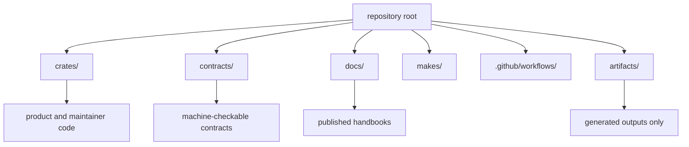

# Workspace Layout

The workspace layout separates product code, maintainer code, shared contracts,
and generated artifacts so repository concerns stay inspectable.

## Root Layout

- `crates/` for Rust package ownership boundaries
- `contracts/` for shared machine-checkable contract assets
- `docs/` for published handbook sources
- `makes/` for repository command entrypoints
- `.github/workflows/` for hosted automation entrypoints
- `artifacts/` for generated outputs that must stay out of tracked roots

## Layout Rule

Root directories should make ownership more obvious, not less. If a new root
directory weakens that rule, it needs repository-handbook justification.

## Next Reads

- [Package Map](package-map.md)
- [Documentation System](documentation-system.md)
- [Core Architecture](../architecture/workspace-topology.md)
