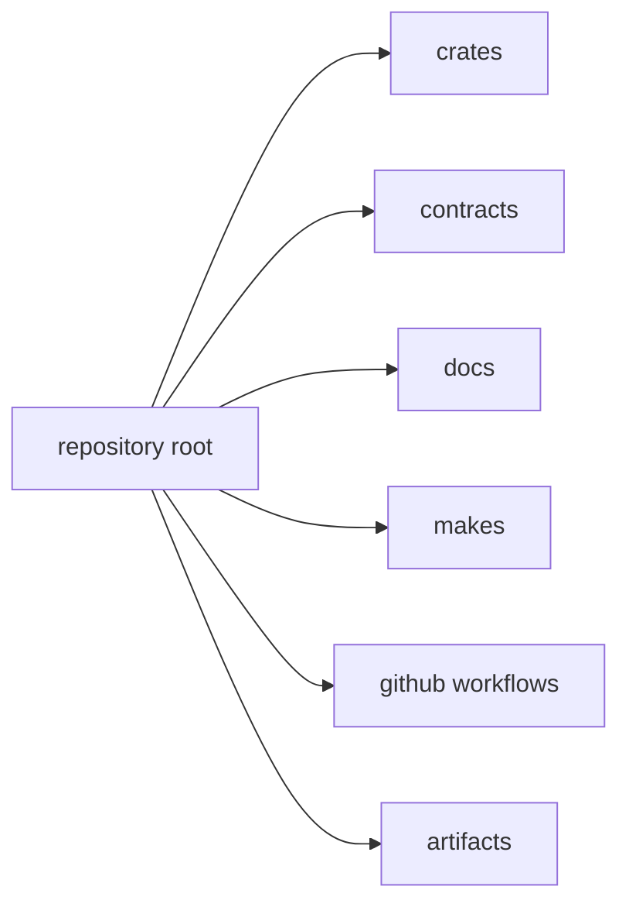

# Workspace Layout

This page explains why the repository root is shaped the way it is.

The layout is meant to make ownership obvious at a glance. Source code,
contracts, docs, workflows, and generated outputs live in separate roots so a
reader can tell what a directory is for before opening it.

## Root Map

## Root Layout

- `crates/` for Rust package ownership boundaries
- `contracts/` for shared machine-checkable contract assets
- `docs/` for published handbook sources
- `makes/` for repository command entrypoints
- `.github/workflows/` for hosted automation entrypoints
- `artifacts/` for generated outputs that must stay out of tracked roots

## Layout Rule

Root directories should make ownership more obvious, not less. If a new root
directory weakens that rule, it needs repository-handbook justification.

## Reading Rule

Use this page when the repository root feels crowded or ambiguous and the first
question is where a new surface belongs.

## Next Reads

- [Package Map](package-map.md)
- [Package Boundary](package-boundary.md)
- [Core Architecture](../architecture/workspace-topology.md)
