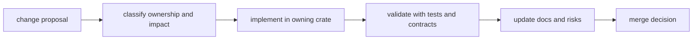

# Change Management

This page explains how repository changes move from proposal to merge without
losing ownership or evidence along the way.

The point is not ceremony. The point is to keep scope, proof, and
documentation attached to the same change so the repository does not create
another debugging round later.

## Change Flow

## Required Steps

1. identify owning crate and handbook section
2. classify impact as internal, interface, or compatibility-sensitive
3. run targeted and cross-surface validation
4. update docs, risks, and decision records where applicable
5. merge only with reviewable evidence attached

## Evidence Rules

- assertions without tests or contract checks are incomplete
- compatibility-sensitive changes require explicit migration notes
- docs updates belong in the same change set as behavior updates

## Evidence Bundle Checklist

Attach this minimum bundle for cross-program changes:

1. ownership scope statement with affected handbook pages
2. command/test evidence from owning crates
3. compatibility impact note (`none`, `additive`, or `breaking`)
4. documentation updates linked to changed behavior

## Reading Rule

Use this page when a change is already real work and the main question is how
to carry it through review without losing scope or evidence.

## Code Anchors

- `crates/bijux-dev/src/suites/`
- `crates/bijux-dev/src/commands/contract_governance.rs`
- `crates/bijux-dev/src/commands/docs_governance.rs`

## Next Reads

- [Testing and Validation](testing-and-validation.md)
- [Decision Record Policy](decision-record-policy.md)
- [Risk and Exceptions](risk-and-exceptions.md)
