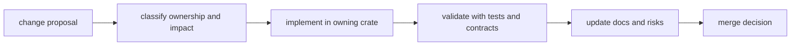

# Change Management

Repository change management in `bijux-core` is about keeping one story
intact from edit to merge: what changed, who owns it, what proves it, and what
the repository now supports because of it.

That matters more here than in a smaller single-product repo because a change
can cross runtime behavior, contracts, retained artifacts, generated docs, and
release evidence even when the code diff looks small.

## Change Flow

## The Minimum Change Story

Every meaningful repository change should make four things easy to answer:

1. what surface changed
2. which handbook, crate, or root entrypoint owns it
3. what validation proves the new state
4. what documentation or compatibility surface moved with it

If one of those answers is missing, the repository is likely to pay for it in a
later debugging or release cycle.

## Required Steps

1. identify owning crate and handbook section
2. classify impact as internal, interface, or compatibility-sensitive
3. run targeted and cross-surface validation
4. update docs, risks, and decision records where applicable
5. merge only with reviewable evidence attached

## How To Classify Impact

### Internal

The change stays inside one owned implementation surface and does not alter
public or retained meaning.

### Interface

The change alters a user-facing, machine-facing, or reader-facing interface but
does not necessarily break a compatibility promise.

### Compatibility-sensitive

The change alters a documented or retained contract that downstream users,
stored runs, or release surfaces may already depend on.

## Evidence Rules

- assertions without tests or contract checks are incomplete
- compatibility-sensitive changes require explicit migration notes
- docs updates belong in the same change set as behavior updates

## Evidence Bundle Checklist

Attach this minimum bundle for cross-program changes:

1. ownership scope statement with affected handbook pages
2. command/test evidence from owning crates
3. compatibility impact note (`none`, `additive`, or `breaking`)
4. documentation updates linked to changed behavior

## What Good Change Management Prevents

- behavior changing without matching docs
- release notes trying to summarize a contract shift that was never explained
- root rules moving without matching validation
- cross-product changes landing as if they were one-crate edits

## Code Anchors

- `crates/bijux-dev/src/suites/`
- `crates/bijux-dev/src/commands/contract_governance.rs`
- `crates/bijux-dev/src/commands/docs_governance.rs`

## Next Reads

- [Testing and Validation](testing-and-validation.md)
- [Decision Record Policy](decision-record-policy.md)
- [Risk and Exceptions](risk-and-exceptions.md)
