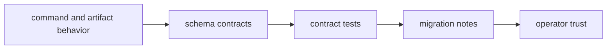

# Compatibility and Schema

This page explains how the repository keeps behavior, schemas, and compatibility
claims from drifting apart.

The risk here is subtle: a command can still run while its documented contract,
snapshots, or migration story quietly fall out of sync.

## Compatibility Flow

## Governance Scope

- CLI output envelopes and compatibility claims
- DAG replay/diff proof, explain, and artifact schemas
- maintainer evidence schema stability
- migration notes for breaking changes

## Required Controls

- schema changes require contract-test updates
- compatibility labels must match observed behavior
- migration guidance is mandatory for breaking updates

## Reading Rule

Use this page when a change touches outputs, schemas, or compatibility labels
and the question is what must stay aligned.

## Code Anchors

- `contracts/`
- `crates/bijux-dag-app/tests/replay_diff_hardening_contract.rs`
- `crates/bijux-cli/tests/`
- `crates/bijux-dev/tests/evidence_schema_contracts.rs`

## Next Reads

- [Testing and Validation](testing-and-validation.md)
- [Change Management](change-management.md)
- [CLI Compatibility Commitments](../../bijux-cli/interfaces/compatibility-commitments.md)
