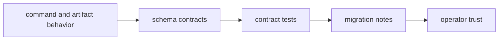

# Compatibility and Schema

In `bijux-core`, compatibility is not only about whether a command still runs.
It is about whether the repository's code, schemas, retained artifacts,
snapshots, generated references, and migration guidance still describe the same
supported behavior.

That is why schema work is treated as a repository concern rather than a narrow
serialization detail. Once a field or vocabulary is documented, retained, or
consumed across surfaces, it becomes part of the compatibility story.

## Compatibility Flow

## What Counts As Compatibility Here

- CLI output envelopes and compatibility claims
- DAG replay/diff proof, explain, and artifact schemas
- maintainer evidence schema stability
- migration notes for breaking changes

## Where Drift Usually Starts

Compatibility drift often begins in places that still look superficially green:

- a command output stays parseable but changes meaning
- a retained run artifact adds or renames a field
- a generated reference page is not refreshed after a contract change
- migration notes describe a different boundary than the code now enforces

Those are precisely the cases this repository tries to catch early.

## Required Controls

- schema changes require contract-test updates
- compatibility labels must match observed behavior
- migration guidance is mandatory for breaking updates

## What A Safe Contract Change Includes

A compatibility-sensitive change is usually incomplete unless it carries:

- the owning schema or contract update
- tests or snapshots that prove the new shape
- docs that explain the new supported meaning
- a migration note when the change is breaking or behaviorally surprising

## Code Anchors

- `contracts/`
- `crates/bijux-dag-app/tests/replay_diff_hardening_contract.rs`
- `crates/bijux-cli/tests/`
- `crates/bijux-dev/tests/evidence_schema_contracts.rs`

## Next Reads

- [Testing and Validation](testing-and-validation.md)
- [Change Management](change-management.md)
- [CLI Compatibility Commitments](../../bijux-cli/interfaces/compatibility-commitments.md)
