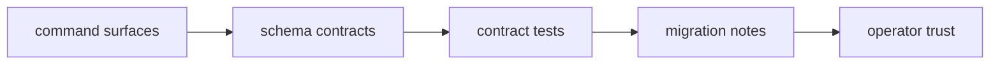

# Compatibility and Schema

Compatibility and schema governance prevent drift between command behavior,
artifacts, and integration expectations.

## Visual Summary

## Governance Scope

- CLI output envelopes and compatibility claims
- DAG replay/diff proof, explain, and artifact schemas
- maintainer evidence schema stability
- migration notes for breaking changes

## Required Controls

- schema changes require contract-test updates
- compatibility labels must match observed behavior
- migration guidance is mandatory for breaking updates

## Code Anchors

- `contracts/`
- `crates/bijux-dag-app/tests/replay_diff_hardening_contract.rs`
- `crates/bijux-cli/tests/`
- `crates/bijux-dev/tests/evidence_schema_contracts.rs`

## Next Reads

- [Testing and Validation](testing-and-validation.md)
- [Change Management](change-management.md)
- [CLI Compatibility Commitments](../../bijux-cli/interfaces/compatibility-commitments.md)
