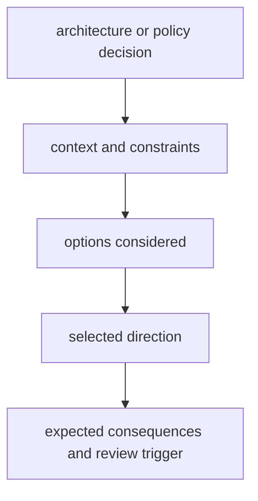

# Decision Record Policy

Decision records capture high-impact architecture and governance choices so
future work can evaluate intent, tradeoffs, and rollback options.

## Visual Summary

## When a Record Is Required

- dependency or ownership boundary changes
- compatibility policy changes that affect operators or integrators
- release or governance rule changes with cross-program impact

## Record Contents

- decision statement and affected surfaces
- alternatives considered and rejection reasons
- migration or rollback plan when relevant
- verification criteria for future review

## Code Anchors

- `docs/bijux-core/governance/`
- `crates/bijux-dev/src/commands/contract_governance.rs`
- `crates/bijux-dev/src/commands/docs_governance.rs`

## Next Reads

- [Change Management](change-management.md)
- [Release and Versioning](release-and-versioning.md)
- [Risk and Exceptions](risk-and-exceptions.md)
