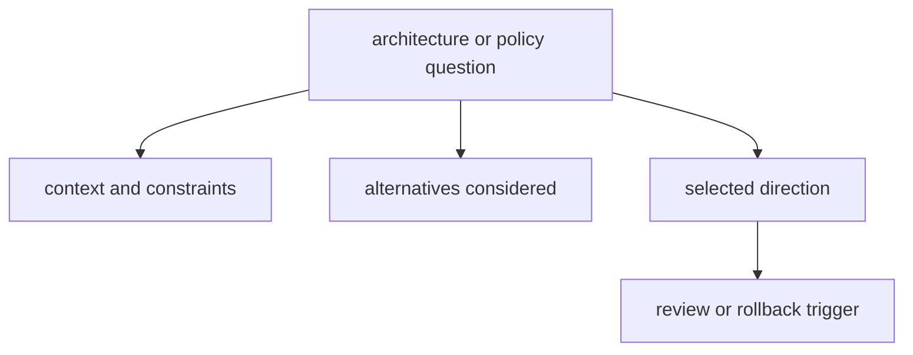

# Decision Record Policy

Decision records preserve the reasoning behind the choices that reshape this
repository.

They matter when a later change needs more than the final answer. A good record
shows what pressure existed at the time, what alternatives were considered, and
what would need to change before the decision should be reopened.

## Decision Flow

## When a Record Is Required

- dependency or ownership boundary changes
- compatibility policy changes that affect operators or integrators
- release or governance rule changes with cross-program impact

## Record Contents

- decision statement and affected surfaces
- alternatives considered and rejection reasons
- migration or rollback plan when relevant
- verification criteria for future review

## Reading Rule

Use this page when a change touches architecture, compatibility, or governance
and the repository needs a durable explanation rather than a passing PR note.

## Code Anchors

- `docs/bijux-core/governance/`
- `crates/bijux-dev/src/commands/contract_governance.rs`
- `crates/bijux-dev/src/commands/docs_governance.rs`

## Next Reads

- [Change Management](../operations/change-management.md)
- [Release and Versioning](release-and-versioning.md)
- [Risk and Exceptions](risk-and-exceptions.md)
