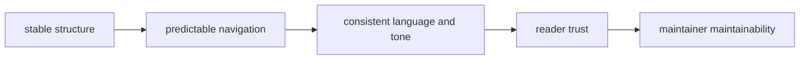
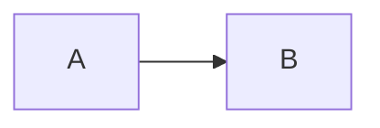

# Documentation Standards

Documentation standards keep this repository aligned with the shared Bijux
handbook model and reduce cognitive switching between projects.

## Visual Summary



## Standards

- each handbook keeps a stable top-level section architecture
- every page includes canonical frontmatter keys
- behavior claims link to code anchors or executable checks
- examples use current command names and realistic paths
- diagrams summarize key system relationships on each page

## Language and Tone Rules

- prefer direct declarative language over speculative wording
- use concrete ownership verbs: `owns`, `does not own`, `requires`, `proves`
- avoid vague filler such as "might be okay" or "generally works"
- when uncertainty exists, state uncertainty and next verification step

## Required Frontmatter Keys

- `title`
- `audience`
- `type`
- `status`
- `owner`
- `last_reviewed`

## Canonical Page Template

````md
---
title: <Page Title>
audience: <operators|maintainers|mixed>
type: <section-index|architecture|governance|operations|quality>
status: canonical
owner: <handbook-owner>
last_reviewed: YYYY-MM-DD
---

# <Page Title>

## Visual Summary


## Core Policy Or Guidance

## Code Anchors

## Next Reads
````

## Code Anchors

- `mkdocs.yml`
- `mkdocs.shared.yml`
- `makes/docs.mk`
- `docs/index.md`

## Next Reads

- [Decision Record Policy](decision-record-policy.md)
- [Risk and Exceptions](risk-and-exceptions.md)
- [Maintainer Documentation Standard](../../bijux-dev/governance/documentation-standard.md)
