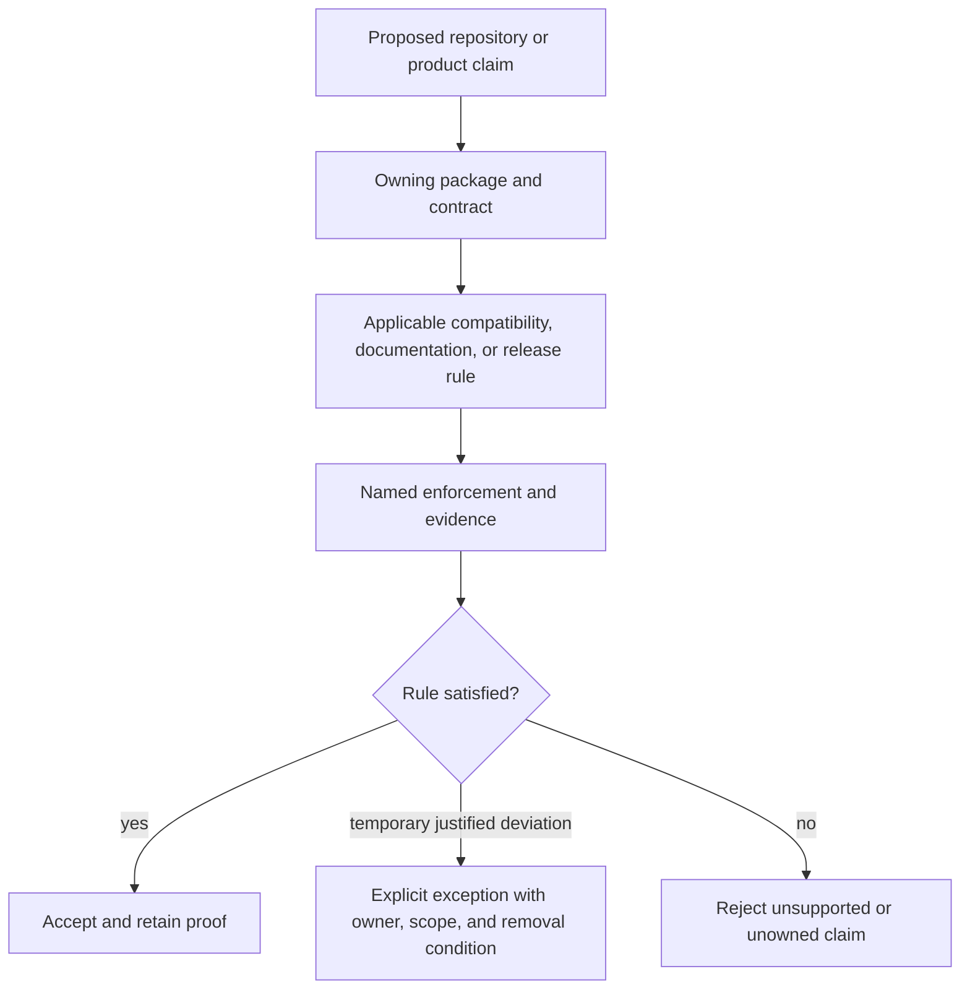

# Core Governance

Core governance defines the repository-wide rules that apply across CLI, DAG,
the Python bridge, and the maintainer surface.

This section remains the policy detail layer. Use
[Operations](../operations/index.md) when the question is primarily about how a
repository workflow is executed rather than which rule justifies it.

## Governance Objectives

- keep ownership boundaries explicit and enforceable
- require evidence before compatibility or release claims
- align documentation with executable behavior and contracts
- make risk decisions visible and reviewable

## Rule Hierarchy

| Question | Governing surface |
| --- | --- |
| who owns implementation and publication? | [Package Ownership](package-ownership.md) |
| what remains compatible across versions? | [Compatibility and Schema](compatibility-and-schema.md) |
| which prose is public, normative, internal, or evidence? | [Documentation Standards](documentation-standards.md) |
| when does a durable architectural decision need a record? | [Decision Record Policy](decision-record-policy.md) |
| how is a justified deviation constrained? | [Risk and Exceptions](risk-and-exceptions.md) |
| how do specifications map to code and tests? | [Spec-To-Code And Test Ownership](spec-to-code-and-test-ownership.md) |
| what evidence supports a trust claim? | [Trust Evidence](trust-evidence.md) |

Rules do not become optional because their enforcement lives in different
tools. A Rust contract test, Python test, generated report check, Make target,
and hosted workflow can all enforce one repository decision at different
boundaries.

## Exception Standard

An exception is reviewable only when it names:

- the exact rule and affected surface;
- the owner who can resolve it;
- the risk accepted by keeping the deviation;
- the evidence that remains required;
- the condition that removes the exception.

An undocumented skip, advisory-only execution, reduced test selection, or
stale report is not an exception. It is incomplete evidence.

## Related Root Pages

- [Foundation](../foundation/index.md)
- [Operations](../operations/index.md)
- [Repository Handbook](../index.md)

## Pages In This Section

- [Package Ownership](package-ownership.md)
- [Compatibility and Schema](compatibility-and-schema.md)
- [Documentation Standards](documentation-standards.md)
- [Decision Record Policy](decision-record-policy.md)
- [Risk and Exceptions](risk-and-exceptions.md)

## Reading Rule

Use this section when the question is about which rule applies, why it exists,
or where an exception would need to be justified. Use Operations when the rule
is already clear and the next question is how to carry it out.
