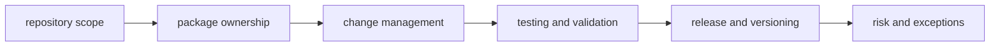

# Core Governance

Core governance defines repository-wide policies that apply across CLI, DAG,
Python bridge, and maintainer control-plane work.

## Visual Summary

## Governance Objectives

- keep ownership boundaries explicit and enforceable
- require evidence before compatibility or release claims
- align documentation with executable behavior and contracts
- make risk decisions visible and reviewable

## Pages In This Section

- [Repository Scope](repository-scope.md)
- [Package Ownership](package-ownership.md)
- [Change Management](change-management.md)
- [Testing and Validation](testing-and-validation.md)
- [Release and Versioning](release-and-versioning.md)
- [Compatibility and Schema](compatibility-and-schema.md)
- [Documentation Standards](documentation-standards.md)
- [Decision Record Policy](decision-record-policy.md)
- [Risk and Exceptions](risk-and-exceptions.md)
